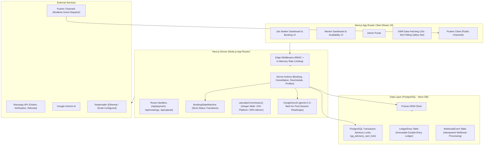
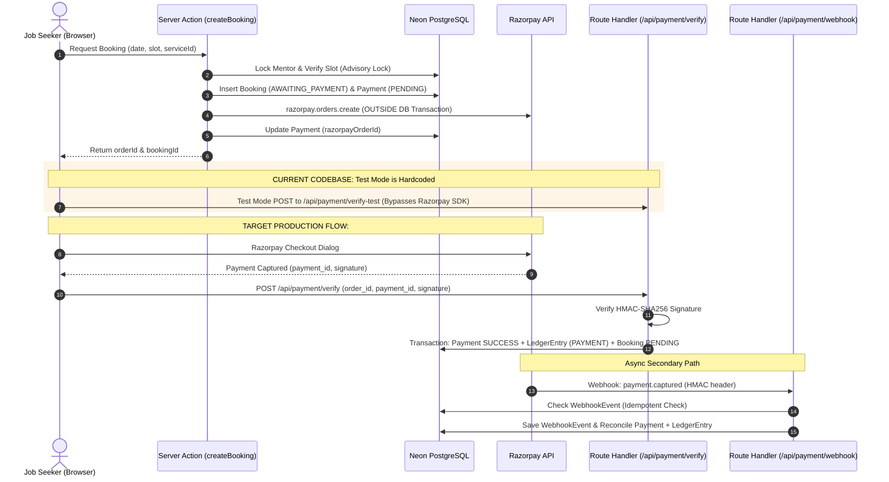
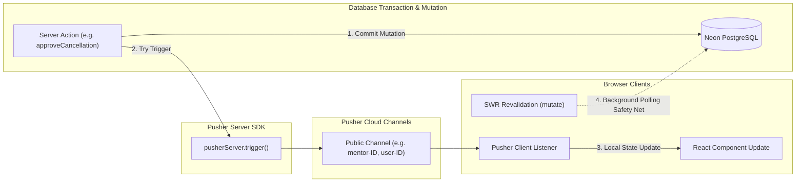
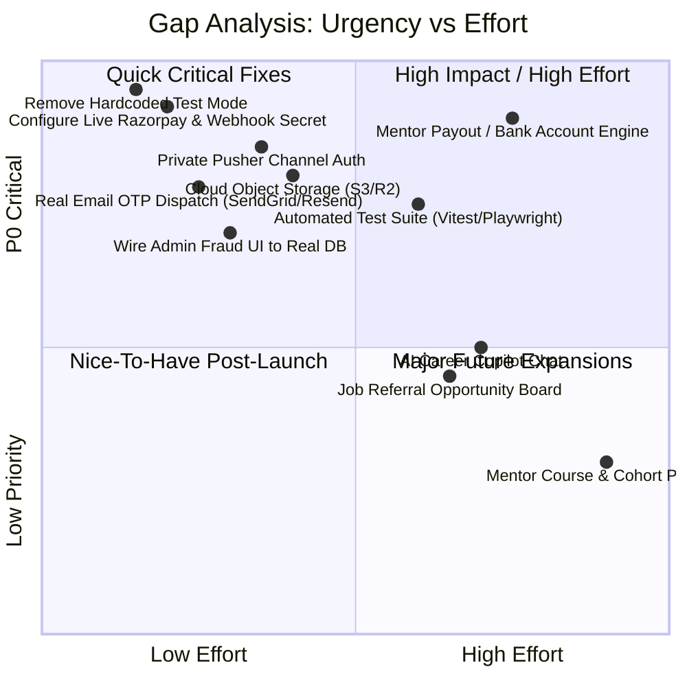
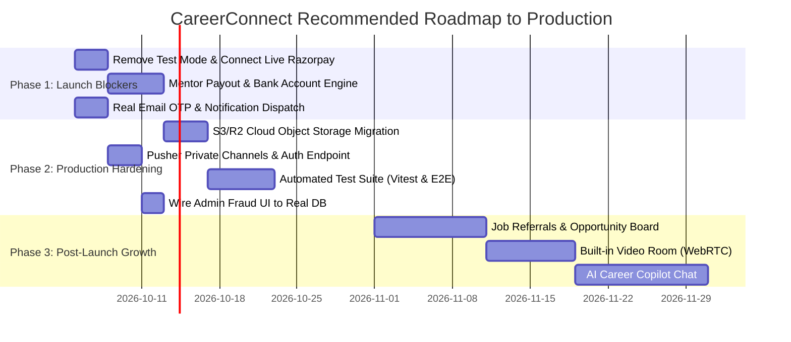

# CareerConnect — Complete Development Status & Remaining Roadmap

**Audit Date:** October 2026  
**Audited Target:** CareerConnect Platform (`sas platform/career-connect`)  
**Audit Type:** Codebase Inspection & Production Gap Analysis (Zero Application Code Modified)  
**Document Classification:** Technical Architecture & Production Status Audit  

---

## 1. Executive Summary

A comprehensive, line-by-line inspection of the **CareerConnect** platform was conducted to determine the actual state of development against the **Target Product Vision**. CareerConnect is envisioned as an online career mentorship, mock interview, and professional guidance platform designed to bridge the professional-network gap for job seekers who lack industry connections.

### Key Audit Findings

1. **Foundational Architecture Is Solid**:
   - The platform is built on Next.js 16 (App Router), React 19, TypeScript, Tailwind CSS v4, and Prisma ORM connected to a Neon PostgreSQL instance.
   - Core relational workflows for mentor discovery, time-slot computation, booking state transitions, and two-sided reschedule/cancellation requests are implemented in backend server actions with transaction isolation.

2. **Job Seeker Cancellation Flow Status (Verified)**:
   - Contrary to earlier reports stating the Job Seeker cancel button was missing, **the Cancel Booking button and interactive modal are fully implemented** in [`src/components/dashboard/BookingsClient.tsx`](file:///c:/Users/LENOVO/Desktop/sas%20platform/career-connect/src/components/dashboard/BookingsClient.tsx#L377) and [`src/components/booking/CancellationModal.tsx`](file:///c:/Users/LENOVO/Desktop/sas%20platform/career-connect/src/components/booking/CancellationModal.tsx).
   - The full cancellation request flow—including the 24-hour refund eligibility check, mentor review, mentor approval/rejection actions, Razorpay refund gateway call, double-entry financial ledger reversal, slot reopening, meeting link revocation, and real-time notification alerts—is written and connected.

3. **Transaction Reliability & Payment Bug Fix (Verified)**:
   - The reported fix for `"Transaction API error: Unable to start a transaction in the given time"` exists in the code:
     - Prisma interactive transactions now specify `{ maxWait: 10000, timeout: 20000 }` in [`src/actions/booking-actions.ts`](file:///c:/Users/LENOVO/Desktop/sas%20platform/career-connect/src/actions/booking-actions.ts#L397).
     - Network calls to `razorpay.orders.create` have been moved **outside** the database transaction in [`src/actions/booking-actions.ts`](file:///c:/Users/LENOVO/Desktop/sas%20platform/career-connect/src/actions/booking-actions.ts#L399-L420).

4. **Production Blockers (Gaps to Address Before Real Customers & Real Money)**:
   - **Hardcoded Test Mode**: Both [`src/components/booking/BookingPageClient.tsx`](file:///c:/Users/LENOVO/Desktop/sas%20platform/career-connect/src/components/booking/BookingPageClient.tsx#L517) and [`src/components/payment/RazorpayButton.tsx`](file:///c:/Users/LENOVO/Desktop/sas%20platform/career-connect/src/components/payment/RazorpayButton.tsx#L32) have `const isTestMode = true;` hardcoded, bypassing Razorpay and routing payments to `/api/payment/verify-test` (which returns HTTP 403 Forbidden in `NODE_ENV === "production"`).
   - **No Automated Mentor Payouts**: The financial ledger tracks platform fees (10%) and mentor net earnings (90%), but **no automated payout engine, bank account KYC model, or settlement gateway integration exists**. The "Withdraw Funds" button in [`src/app/mentor/earnings/page.tsx`](file:///c:/Users/LENOVO/Desktop/sas%20platform/career-connect/src/app/mentor/earnings/page.tsx#L79) has no click handler or backend action.
   - **Public Unauthenticated Realtime Channels**: Pusher channels are public (e.g. `mentor-${mentorId}`, `user-${userId}`, `conversation-${id}`). There is **no Pusher authorization endpoint (`/api/pusher/auth`)** or private channel configuration.
   - **File Uploads As Raw Base64**: Files are converted to inline Base64 data URIs in [`src/app/api/upload/route.ts`](file:///c:/Users/LENOVO/Desktop/sas%20platform/career-connect/src/app/api/upload/route.ts#L48-L52) rather than using cloud object storage (S3 / R2 / Blob).
   - **Email OTP Logged to Console**: Company verification OTPs are logged via `console.log` in [`src/app/api/verify-company/route.ts`](file:///c:/Users/LENOVO/Desktop/sas%20platform/career-connect/src/app/api/verify-company/route.ts#L34-L36) rather than dispatched via SMTP.
   - **Zero Automated Tests**: No Jest, Vitest, Cypress, or Playwright setup exists; no CI/CD pipeline or automated test script is present in `package.json`.

---

## 2. CareerConnect Product Vision

CareerConnect is designed to level the professional playing field for job seekers who lack privileged networks, family connections, or alumni mentorship.

### Core Value Pillars

| Pillar | Intended Purpose | Target Experience |
|---|---|---|
| **Access & Discovery** | Connect job seekers with verified working professionals across industries. | Granular search by role, company tier, skills, experience, and transparent pricing. |
| **Guidance & Preparation** | 1-on-1 career strategy sessions and repeatable mock interviews. | Objective feedback rubrics, actionable takeaways, and structured improvement paths. |
| **Course & Continuous Learning** | Ongoing learning programs created by mentors. | Extending the relationship beyond a single 45-minute booking into multi-week mentorship. |
| **Professional Connections** | Relevant job opportunities and non-guaranteed professional referrals. | Natural referrals based on merit and company policy without false promises of guaranteed jobs. |
| **Trust, Safety & Fair Financials** | Auditable, transparent transactions with clear refund and cancellation rights. | Double-entry financial accounting, clear 24h refund windows, verified credentials, and prompt payouts. |

---

## 3. Target Users

### Job Seekers
- **Profile**: Fresh graduates, career transitioners, and early-to-mid career professionals lacking industry mentors.
- **Needs**: Real interview practice, resume audits, honest domain insights, structured roadmaps, and potential referrals.
- **Platform Experience**: Frictionless discovery, secure payments, easy rescheduling, self-service cancellation, meeting entry, notes, and task tracking.

### Mentors
- **Profile**: Experienced software engineers, product managers, data scientists, and executives.
- **Needs**: Effortless availability management, zero scheduling collisions, fair compensation, transparent earnings, and control over cancellations.
- **Platform Experience**: Availability calendar, buffer times, advance windows, 1-click booking confirmation/rejection, cancellation reviews, review management, and payout tracking.

### Admins
- **Profile**: Platform operations, compliance, customer support, and financial managers.
- **Needs**: Verification workflows, dispute resolution, platform take-rate analytics, fraud deterrence, and system auditability.
- **Platform Experience**: Mentor verification review queue, user suspension controls, session logs, transaction logs, and platform revenue dashboards.

---

## 4. Current Technology Architecture



---

## 5. Current Development Status Summary

| Area | Status | Evidence (File & Line) | Remaining Work | Priority |
|---|---|---|---|---|
| **Authentication** | 🟢 FULL | [`src/lib/auth.ts`](file:///c:/Users/LENOVO/Desktop/sas%20platform/career-connect/src/lib/auth.ts#L48), [`src/middleware.ts`](file:///c:/Users/LENOVO/Desktop/sas%20platform/career-connect/src/middleware.ts) | OAuth providers (Google/GitHub) require production client secrets | P1 |
| **Job Seeker Profile** | 🟢 FULL | [`src/actions/job-seeker-profile-actions.ts`](file:///c:/Users/LENOVO/Desktop/sas%20platform/career-connect/src/actions/job-seeker-profile-actions.ts#L8), [`src/app/dashboard/profile/edit/page.tsx`](file:///c:/Users/LENOVO/Desktop/sas%20platform/career-connect/src/app/dashboard/profile/edit/page.tsx) | Target job recommendations based on profile | P2 |
| **Mentor Discovery** | 🟢 FULL | [`src/components/mentors/MentorsContent.tsx`](file:///c:/Users/LENOVO/Desktop/sas%20platform/career-connect/src/components/mentors/MentorsContent.tsx), [`src/actions/mentor-actions.ts`](file:///c:/Users/LENOVO/Desktop/sas%20platform/career-connect/src/actions/mentor-actions.ts) | Search performance indexing for large catalogs | P2 |
| **Booking Creation** | 🟢 FULL | [`src/actions/booking-actions.ts:L345`](file:///c:/Users/LENOVO/Desktop/sas%20platform/career-connect/src/actions/booking-actions.ts#L345) | Connect real Razorpay keys in production | P0 |
| **Rescheduling** | 🟢 FULL | [`src/actions/reschedule-actions.ts:L81`](file:///c:/Users/LENOVO/Desktop/sas%20platform/career-connect/src/actions/reschedule-actions.ts#L81) | Self-service mentor-initiated reschedule | P2 |
| **Cancellation (Backend)** | 🟢 FULL | [`src/actions/cancellation-actions.ts:L16`](file:///c:/Users/LENOVO/Desktop/sas%20platform/career-connect/src/actions/cancellation-actions.ts#L16) | None for 1:1 sessions | Done |
| **Cancellation (Job Seeker UI)**| 🟢 FULL | [`src/components/dashboard/BookingsClient.tsx:L377`](file:///c:/Users/LENOVO/Desktop/sas%20platform/career-connect/src/components/dashboard/BookingsClient.tsx#L377), [`src/components/booking/CancellationModal.tsx`](file:///c:/Users/LENOVO/Desktop/sas%20platform/career-connect/src/components/booking/CancellationModal.tsx) | None | Done |
| **Cancellation (Mentor Review UI)**| 🟢 FULL | [`src/components/mentor/MentorBookingsClient.tsx:L399`](file:///c:/Users/LENOVO/Desktop/sas%20platform/career-connect/src/components/mentor/MentorBookingsClient.tsx#L399) | None | Done |
| **Meetings** | 🟡 PARTIAL | [`src/app/api/meetings/[id]/join/route.ts`](file:///c:/Users/LENOVO/Desktop/sas%20platform/career-connect/src/app/api/meetings/%5Bid%5D/join/route.ts) | Built-in in-app video room or dynamic WebRTC | P2 |
| **Reviews & Ratings** | 🟢 FULL | [`src/actions/review-actions.ts`](file:///c:/Users/LENOVO/Desktop/sas%20platform/career-connect/src/actions/review-actions.ts#L8) | Mentor reply to review capability | P2 |
| **Direct Messaging** | 🟢 FULL | [`src/actions/message-actions.ts`](file:///c:/Users/LENOVO/Desktop/sas%20platform/career-connect/src/actions/message-actions.ts), [`src/components/messages/MessagesClient.tsx`](file:///c:/Users/LENOVO/Desktop/sas%20platform/career-connect/src/components/messages/MessagesClient.tsx) | Typing indicators & read receipts | P2 |
| **Notifications** | 🟢 FULL | [`src/actions/notification-actions.ts`](file:///c:/Users/LENOVO/Desktop/sas%20platform/career-connect/src/actions/notification-actions.ts), [`src/components/layout/NotificationDropdown.tsx`](file:///c:/Users/LENOVO/Desktop/sas%20platform/career-connect/src/components/layout/NotificationDropdown.tsx) | External email delivery for notifications | P1 |
| **Payment Orders & Capture** | 🟡 PARTIAL | [`src/actions/booking-actions.ts:L399`](file:///c:/Users/LENOVO/Desktop/sas%20platform/career-connect/src/actions/booking-actions.ts#L399), [`src/app/api/payment/verify/route.ts`](file:///c:/Users/LENOVO/Desktop/sas%20platform/career-connect/src/app/api/payment/verify/route.ts) | Frontend hardcoded test mode bypass must be removed | P0 |
| **Payment Webhooks** | 🟢 FULL | [`src/app/api/payment/webhook/route.ts`](file:///c:/Users/LENOVO/Desktop/sas%20platform/career-connect/src/app/api/payment/webhook/route.ts) | Production webhook secret deployment on Razorpay dashboard | P0 |
| **Financial Ledger** | 🟢 FULL | [`src/lib/payment-service.ts`](file:///c:/Users/LENOVO/Desktop/sas%20platform/career-connect/src/lib/payment-service.ts#L77), [`src/lib/commission.ts`](file:///c:/Users/LENOVO/Desktop/sas%20platform/career-connect/src/lib/commission.ts) | Ledger export in CSV/Excel for accounting | P1 |
| **Refunds Execution** | 🟢 FULL | [`src/actions/cancellation-actions.ts:L185`](file:///c:/Users/LENOVO/Desktop/sas%20platform/career-connect/src/actions/cancellation-actions.ts#L185), [`src/lib/payment-service.ts:L117`](file:///c:/Users/LENOVO/Desktop/sas%20platform/career-connect/src/lib/payment-service.ts#L117) | Automated batch reconciliation | P1 |
| **Mentor Payouts / Settlements**| 🔴 NOT IMPL | [`src/app/mentor/earnings/page.tsx:L79`](file:///c:/Users/LENOVO/Desktop/sas%20platform/career-connect/src/app/mentor/earnings/page.tsx#L79) | KYC, Bank account model, Razorpay Route / Payouts API | P0 |
| **Subscriptions & Billing** | 🔵 FOUNDATION | [`src/components/dashboard/SubscriptionsClient.tsx`](file:///c:/Users/LENOVO/Desktop/sas%20platform/career-connect/src/components/dashboard/SubscriptionsClient.tsx), [`src/app/api/seed/subscription/route.ts`](file:///c:/Users/LENOVO/Desktop/sas%20platform/career-connect/src/app/api/seed/subscription/route.ts) | Recurring card mandates, Razorpay Subscriptions integration | P2 |
| **Document Storage** | 🟡 PARTIAL | [`src/app/api/upload/route.ts:L48`](file:///c:/Users/LENOVO/Desktop/sas%20platform/career-connect/src/app/api/upload/route.ts#L48), [`src/app/api/documents/route.ts`](file:///c:/Users/LENOVO/Desktop/sas%20platform/career-connect/src/app/api/documents/route.ts) | Replace Base64 Data URI with AWS S3 / Cloudflare R2 | P1 |
| **Job Seeker Tasks** | 🟢 FULL | [`src/components/dashboard/TasksClient.tsx`](file:///c:/Users/LENOVO/Desktop/sas%20platform/career-connect/src/components/dashboard/TasksClient.tsx), [`src/app/api/tasks/route.ts`](file:///c:/Users/LENOVO/Desktop/sas%20platform/career-connect/src/app/api/tasks/route.ts) | Push notification for upcoming deadlines | P3 |
| **Realtime (Pusher)** | 🟡 PARTIAL | [`src/lib/pusher.ts`](file:///c:/Users/LENOVO/Desktop/sas%20platform/career-connect/src/lib/pusher.ts), [`src/lib/pusher-client.ts`](file:///c:/Users/LENOVO/Desktop/sas%20platform/career-connect/src/lib/pusher-client.ts) | Private channel authentication (`authEndpoint`) | P1 |
| **Security & RBAC** | 🟢 FULL | [`src/middleware.ts`](file:///c:/Users/LENOVO/Desktop/sas%20platform/career-connect/src/middleware.ts), [`next.config.ts`](file:///c:/Users/LENOVO/Desktop/sas%20platform/career-connect/next.config.ts) | Distributed Redis rate-limiting (Upstash) | P1 |
| **AI Capabilities** | 🔵 FOUNDATION | [`src/actions/booking-actions.ts:L858`](file:///c:/Users/LENOVO/Desktop/sas%20platform/career-connect/src/actions/booking-actions.ts#L858) | AI Career Copilot, resume parser, mock interview bot | P2 |
| **Courses & Programs** | 🔴 NOT IMPL | None (zero occurrence in codebase) | Course models, video hosting, enrollments, lessons | P3 |
| **Referrals / Jobs Board** | 🔴 NOT IMPL | [`src/components/dashboard/JobSeekerDashboardClient.tsx:L211`](file:///c:/Users/LENOVO/Desktop/sas%20platform/career-connect/src/components/dashboard/JobSeekerDashboardClient.tsx#L211) (mock only) | Opportunity feed, referral submission & tracking | P2 |
| **Admin Operations** | 🟢 FULL | [`src/actions/admin-actions.ts`](file:///c:/Users/LENOVO/Desktop/sas%20platform/career-connect/src/actions/admin-actions.ts), [`src/app/admin`](file:///c:/Users/LENOVO/Desktop/sas%20platform/career-connect/src/app/admin) | Wire Fraud UI to real database security tables | P1 |
| **Automated Testing** | 🔴 NOT IMPL | Ad-hoc scripts (`verify_phase1.ts`, `test-booking.ts`) only | Jest/Vitest unit tests, Playwright E2E suite | P1 |
| **Observability** | 🔵 FOUNDATION | Basic console logs; no Sentry or OpenTelemetry | Sentry error tracking, structured Pino logger | P1 |

---

## 6. Phase 1 Audit: Database Production Hardening

### Reported Claims
- Performance indexes on query paths.
- Critical transaction isolation.
- Double-booking prevention.

### Codebase Reality Check: 🟢 FULLY VERIFIED
1. **Indexes**: In [`prisma/schema.prisma`](file:///c:/Users/LENOVO/Desktop/sas%20platform/career-connect/prisma/schema.prisma#L375-L380):
   ```prisma
   @@index([userId, startTime])
   @@index([mentorId, startTime, status])
   @@index([status, startTime])
   @@index([status, endTime])
   @@index([date])
   ```
2. **Transaction Isolation**: Interactive transactions are used with explicit options `{ maxWait: 10000, timeout: 20000 }` in [`src/actions/booking-actions.ts`](file:///c:/Users/LENOVO/Desktop/sas%20platform/career-connect/src/actions/booking-actions.ts#L397).
3. **Double Booking**: Overlapping check is executed inside `$transaction` before insertion:
   ```typescript
   where: {
     mentorId,
     status: { in: ["AWAITING_PAYMENT", "PENDING", "CONFIRMED"] },
     startTime: { lt: bookingEnd },
     endTime: { gt: bookingStart },
     NOT: {
       status: "AWAITING_PAYMENT",
       createdAt: { lt: new Date(Date.now() - 15 * 60 * 1000) },
     },
   }
   ```

---

## 7. Phase 2 Audit: Booking & Availability Reliability

### Reported Claims
- PostgreSQL transaction advisory locks.
- Concurrency overlap protection.
- Availability validation and reschedule collision protection.

### Codebase Reality Check: 🟢 FULLY VERIFIED
1. **PostgreSQL Advisory Locks**:
   - `SELECT pg_advisory_xact_lock(hashtext(${mentorId}))` is called in:
     - `createBooking` in [`src/actions/booking-actions.ts:L348`](file:///c:/Users/LENOVO/Desktop/sas%20platform/career-connect/src/actions/booking-actions.ts#L348)
     - `createRescheduleRequest` in [`src/actions/reschedule-actions.ts:L84`](file:///c:/Users/LENOVO/Desktop/sas%20platform/career-connect/src/actions/reschedule-actions.ts#L84)
     - `acceptRescheduleRequest` in [`src/actions/reschedule-actions.ts:L178`](file:///c:/Users/LENOVO/Desktop/sas%20platform/career-connect/src/actions/reschedule-actions.ts#L178)
     - `approveCancellationAction` in [`src/actions/cancellation-actions.ts:L204`](file:///c:/Users/LENOVO/Desktop/sas%20platform/career-connect/src/actions/cancellation-actions.ts#L204)
2. **Database Engine Compatibility**: Neon PostgreSQL is configured via `.env` (`DATABASE_URL`), ensuring native support for `pg_advisory_xact_lock`.
3. **Collision Protection**: In both new bookings and reschedule requests, overlapping time window queries `(startTime < end AND endTime > start)` are executed within the advisory-locked transaction scope.

---

## 8. Phase 3 Audit: Security Tightening

### Reported Claims
- Strict RBAC, IDOR protection, security headers, rate limiting.

### Codebase Reality Check: 🟡 PARTIALLY VERIFIED (Solid Core, Gaps in Rate Limiting & Storage)
1. **RBAC & Route Protection**:
   - Verified in [`src/middleware.ts`](file:///c:/Users/LENOVO/Desktop/sas%20platform/career-connect/src/middleware.ts):
     - `/admin/*` requires `role === "ADMIN"`.
     - `/mentor/*` requires `role === "MENTOR"` or `ADMIN`.
     - `/dashboard/*` requires `role === "JOB_SEEKER"` or `ADMIN`.
   - Verified in Server Actions: all mutation actions call `getServerSession(authOptions)` and check user roles or ownership IDs.
2. **IDOR Protection**:
   - In [`src/actions/cancellation-actions.ts:L41`](file:///c:/Users/LENOVO/Desktop/sas%20platform/career-connect/src/actions/cancellation-actions.ts#L41): `if (booking.userId !== session.user.id && session.user.role !== "ADMIN") return Unauthorized`.
   - In [`src/actions/reschedule-actions.ts:L39`](file:///c:/Users/LENOVO/Desktop/sas%20platform/career-connect/src/actions/reschedule-actions.ts#L39): `if (booking.userId !== session.user.id) return Unauthorized`.
   - In [`src/app/api/meetings/[id]/join/route.ts:L33`](file:///c:/Users/LENOVO/Desktop/sas%20platform/career-connect/src/app/api/meetings/%5Bid%5D/join/route.ts#L33): checks `isMentor || isUser`.
3. **Security Headers**: Verified in [`next.config.ts`](file:///c:/Users/LENOVO/Desktop/sas%20platform/career-connect/next.config.ts): HSTS (1 year), `X-Frame-Options: DENY`, `X-Content-Type-Options: nosniff`, `Referrer-Policy`, and CSP are set.
4. **Rate Limiting Gap**: In [`src/middleware.ts:L5`](file:///c:/Users/LENOVO/Desktop/sas%20platform/career-connect/src/middleware.ts#L5), rate limiting uses an in-memory `Map`. On serverless environments (Vercel / Lambda), this memory is isolated per node/instance and resets on cold starts.
5. **Magic Bytes Validation**: File upload validates magic bytes with `file-type` in [`src/app/api/upload/route.ts:L34`](file:///c:/Users/LENOVO/Desktop/sas%20platform/career-connect/src/app/api/upload/route.ts#L34).

---

## 9. Phase 4 Audit: Payment & Financial Infrastructure

### Reported Claims
- Razorpay order creation, server-side price truth, HMAC verification, webhook idempotency, financial ledger, refund reversals, and payout foundation.

### Codebase Reality Check: 🟡 PARTIALLY VERIFIED (Ledger & Webhook Solid; Payouts & Keys Missing)
1. **Server-Side Price Truth**: In [`src/actions/booking-actions.ts:L377`](file:///c:/Users/LENOVO/Desktop/sas%20platform/career-connect/src/actions/booking-actions.ts#L377), booking price is extracted directly from the verified database `SessionType.price` (`service.price`), never from client input.
2. **HMAC-SHA256 Signature Verification**: In [`src/app/api/payment/verify/route.ts:L32`](file:///c:/Users/LENOVO/Desktop/sas%20platform/career-connect/src/app/api/payment/verify/route.ts#L32), standard SHA-256 HMAC digest validation matches `razorpay_order_id + "|" + razorpay_payment_id`.
3. **Webhook Idempotency**: In [`src/app/api/payment/webhook/route.ts:L32`](file:///c:/Users/LENOVO/Desktop/sas%20platform/career-connect/src/app/api/payment/webhook/route.ts#L32), every webhook event is recorded in the `WebhookEvent` table with unique constraint on `eventId`. If `existingEvent.processed` is true, it exits early with a 200 response.
4. **Double-Entry Financial Ledger**: In [`src/lib/payment-service.ts`](file:///c:/Users/LENOVO/Desktop/sas%20platform/career-connect/src/lib/payment-service.ts):
   - On capture: Creates `LedgerEntry` with `type: "PAYMENT"`, `grossAmount`, `platformFee`, `mentorEarnings`.
   - On refund: Creates reversing `LedgerEntry` with `type: "REFUND"`, `-refundAmount`, `-split.platformFee`, `-split.mentorEarnings`.
5. **Commission Engine**: In [`src/lib/commission.ts`](file:///c:/Users/LENOVO/Desktop/sas%20platform/career-connect/src/lib/commission.ts), uses integer math with configurable `PLATFORM_COMMISSION_PERCENT` (default 10%).
6. **Hardcoded Test Mode Gap**:
   - `const isTestMode = true;` in [`src/components/booking/BookingPageClient.tsx:L517`](file:///c:/Users/LENOVO/Desktop/sas%20platform/career-connect/src/components/booking/BookingPageClient.tsx#L517) and [`src/components/payment/RazorpayButton.tsx:L32`](file:///c:/Users/LENOVO/Desktop/sas%20platform/career-connect/src/components/payment/RazorpayButton.tsx#L32) bypasses checkout and calls `/api/payment/verify-test`.
   - In production, `/api/payment/verify-test` returns 403 Forbidden. **If deployed as-is, all user payments would fail in production.**
7. **Payout Infrastructure Absence**: No payout gateway integration (Razorpay Route, Razorpay Payouts, or Cashfree) is coded. Mentor bank details and KYC models do not exist.

---

## 10. Job Seeker Feature Audit

| Feature | Status | Evidence (File & Line) | Description / Gap |
|---|---|---|---|
| **Registration / Login** | 🟢 FULL | [`src/app/login/page.tsx`](file:///c:/Users/LENOVO/Desktop/sas%20platform/career-connect/src/app/login/page.tsx), [`src/app/signup/page.tsx`](file:///c:/Users/LENOVO/Desktop/sas%20platform/career-connect/src/app/signup/page.tsx) | Credentials provider with bcrypt hash |
| **Profile Management** | 🟢 FULL | [`src/actions/job-seeker-profile-actions.ts`](file:///c:/Users/LENOVO/Desktop/sas%20platform/career-connect/src/actions/job-seeker-profile-actions.ts) | Full profile with skills, experience, education |
| **Mentor Discovery & Filters** | 🟢 FULL | [`src/components/mentors/MentorsContent.tsx`](file:///c:/Users/LENOVO/Desktop/sas%20platform/career-connect/src/components/mentors/MentorsContent.tsx) | Search by role, company, tier, pricing, skills |
| **Save Mentors** | 🟢 FULL | [`src/app/api/saved-mentors/route.ts`](file:///c:/Users/LENOVO/Desktop/sas%20platform/career-connect/src/app/api/saved-mentors/route.ts) | Optimistic bookmarking to `SavedMentor` table |
| **Session Booking (Wizard)** | 🟢 FULL | [`src/components/booking/BookingPageClient.tsx`](file:///c:/Users/LENOVO/Desktop/sas%20platform/career-connect/src/components/booking/BookingPageClient.tsx) | 5-step wizard with dates, slots, form, summary |
| **Session Rescheduling** | 🟢 FULL | [`src/actions/reschedule-actions.ts`](file:///c:/Users/LENOVO/Desktop/sas%20platform/career-connect/src/actions/reschedule-actions.ts) | Conflict-locked reschedule request workflow |
| **Booking Cancellation (UI)** | 🟢 FULL | [`src/components/dashboard/BookingsClient.tsx:L377`](file:///c:/Users/LENOVO/Desktop/sas%20platform/career-connect/src/components/dashboard/BookingsClient.tsx#L377) | Red "Cancel Booking" button triggers modal |
| **Cancellation Modal** | 🟢 FULL | [`src/components/booking/CancellationModal.tsx`](file:///c:/Users/LENOVO/Desktop/sas%20platform/career-connect/src/components/booking/CancellationModal.tsx) | Displays 24h refund policy, requires reason |
| **Join Meetings** | 🟡 PARTIAL | [`src/app/api/meetings/[id]/join/route.ts`](file:///c:/Users/LENOVO/Desktop/sas%20platform/career-connect/src/app/api/meetings/%5Bid%5D/join/route.ts) | External redirect (Meet/Zoom); disabled during pending cancellation/reschedule |
| **Review Submission** | 🟢 FULL | [`src/actions/review-actions.ts`](file:///c:/Users/LENOVO/Desktop/sas%20platform/career-connect/src/actions/review-actions.ts) | Rating 1-5 + feedback; updates mentor averages |
| **Direct Messaging** | 🟢 FULL | [`src/components/messages/MessagesClient.tsx`](file:///c:/Users/LENOVO/Desktop/sas%20platform/career-connect/src/components/messages/MessagesClient.tsx) | 1-on-1 thread with unread count and real-time push |
| **Actionable Tasks** | 🟢 FULL | [`src/components/dashboard/TasksClient.tsx`](file:///c:/Users/LENOVO/Desktop/sas%20platform/career-connect/src/components/dashboard/TasksClient.tsx) | Job seeker task tracker with status and deadlines |
| **Document Vault** | 🟡 PARTIAL | [`src/components/dashboard/DocumentsClient.tsx`](file:///c:/Users/LENOVO/Desktop/sas%20platform/career-connect/src/components/dashboard/DocumentsClient.tsx) | Lists documents; upload currently converts to Base64 |
| **AI Career Copilot** | 🔴 NOT IMPL | Target Vision Only | Interactive AI chat for career advice is missing |
| **Referrals / Job Board** | 🔴 NOT IMPL | [`src/components/dashboard/JobSeekerDashboardClient.tsx:L211`](file:///c:/Users/LENOVO/Desktop/sas%20platform/career-connect/src/components/dashboard/JobSeekerDashboardClient.tsx#L211) | Only static "Referrals: 0" UI widget |
| **Mentor-Created Courses** | 🔴 NOT IMPL | Target Vision Only | Zero database models or UI for course enrollment |

---

## 11. Mentor Feature Audit

| Feature | Status | Evidence (File & Line) | Description / Gap |
|---|---|---|---|
| **Mentor Registration Wizard** | 🟢 FULL | [`src/app/mentor-register`](file:///c:/Users/LENOVO/Desktop/sas%20platform/career-connect/src/app/mentor-register) | Multi-step registration for personal, professional info |
| **Document Verification** | 🟢 FULL | [`src/app/mentor-register/documents/page.tsx`](file:///c:/Users/LENOVO/Desktop/sas%20platform/career-connect/src/app/mentor-register/documents/page.tsx) | Uploads ID/Company proof to `VerificationDocument` |
| **Company Domain Verification**| 🟡 PARTIAL | [`src/app/api/verify-company/route.ts`](file:///c:/Users/LENOVO/Desktop/sas%20platform/career-connect/src/app/api/verify-company/route.ts) | OTP generated & verified; prints to server console |
| **Weekly Availability Setup** | 🟢 FULL | [`src/actions/availability-actions.ts`](file:///c:/Users/LENOVO/Desktop/sas%20platform/career-connect/src/actions/availability-actions.ts#L80) | Day-of-week slots, buffer times, advance windows |
| **Blocked Dates** | 🟢 FULL | [`src/actions/availability-actions.ts:L196`](file:///c:/Users/LENOVO/Desktop/sas%20platform/career-connect/src/actions/availability-actions.ts#L196) | Vacation mode and specific date blocking |
| **Mentorship Offerings** | 🟢 FULL | [`src/app/mentor-register/offerings/page.tsx`](file:///c:/Users/LENOVO/Desktop/sas%20platform/career-connect/src/app/mentor-register/offerings/page.tsx) | Configures `SessionType` (duration & pricing in INR) |
| **Booking Acceptance/Rejection**| 🟢 FULL | [`src/actions/booking-actions.ts:L541`](file:///c:/Users/LENOVO/Desktop/sas%20platform/career-connect/src/actions/booking-actions.ts#L541) | Accepts with meeting URL, or rejects with notification |
| **Cancellation Review UI** | 🟢 FULL | [`src/components/mentor/MentorBookingsClient.tsx:L399`](file:///c:/Users/LENOVO/Desktop/sas%20platform/career-connect/src/components/mentor/MentorBookingsClient.tsx#L399) | Mentors can Decline or Approve cancellation requests |
| **Cancellation Approval Logic**| 🟢 FULL | [`src/actions/cancellation-actions.ts:L124`](file:///c:/Users/LENOVO/Desktop/sas%20platform/career-connect/src/actions/cancellation-actions.ts#L124) | Reopens slot, revokes meeting link, triggers refund |
| **Reschedule Review** | 🟢 FULL | [`src/actions/reschedule-actions.ts:L150`](file:///c:/Users/LENOVO/Desktop/sas%20platform/career-connect/src/actions/reschedule-actions.ts#L150) | Accepts or rejects reschedule requests |
| **Post-Session Notes & AI Roadmap**| 🟢 FULL | [`src/actions/booking-actions.ts:L643`](file:///c:/Users/LENOVO/Desktop/sas%20platform/career-connect/src/actions/booking-actions.ts#L643), [`L858`](file:///c:/Users/LENOVO/Desktop/sas%20platform/career-connect/src/actions/booking-actions.ts#L858) | Records ratings/notes; triggers Gemini 2.5 Flash roadmap |
| **Earnings Overview** | 🟡 PARTIAL | [`src/app/mentor/earnings/page.tsx`](file:///c:/Users/LENOVO/Desktop/sas%20platform/career-connect/src/app/mentor/earnings/page.tsx) | Calculates gross earnings and 90% net take-home |
| **Payout Withdrawal** | 🔴 NOT IMPL | [`src/app/mentor/earnings/page.tsx:L79`](file:///c:/Users/LENOVO/Desktop/sas%20platform/career-connect/src/app/mentor/earnings/page.tsx#L79) | "Withdraw Funds" button has no action or bank form |
| **Course Creation** | 🔴 NOT IMPL | Target Vision Only | Mentors cannot currently create courses or cohorts |

---

## 12. Admin Feature Audit

| Feature | Status | Evidence (File & Line) | Description / Gap |
|---|---|---|---|
| **Admin Authentication** | 🟢 FULL | [`src/middleware.ts:L53`](file:///c:/Users/LENOVO/Desktop/sas%20platform/career-connect/src/middleware.ts#L53), [`src/app/admin-login/page.tsx`](file:///c:/Users/LENOVO/Desktop/sas%20platform/career-connect/src/app/admin-login/page.tsx) | Dedicated admin gate with role verification |
| **Dashboard KPIs** | 🟢 FULL | [`src/actions/admin-dashboard-actions.ts:L21`](file:///c:/Users/LENOVO/Desktop/sas%20platform/career-connect/src/actions/admin-dashboard-actions.ts#L21) | Aggregates users, revenue, bookings, verification |
| **Mentor Verification Queue** | 🟢 FULL | [`src/actions/admin-actions.ts:L66`](file:///c:/Users/LENOVO/Desktop/sas%20platform/career-connect/src/actions/admin-actions.ts#L66) | Reviews documents; approves or rejects with reason |
| **User & Mentor Management** | 🟢 FULL | [`src/actions/admin-actions.ts:L168`](file:///c:/Users/LENOVO/Desktop/sas%20platform/career-connect/src/actions/admin-actions.ts#L168) | List, suspend, or delete users and mentors |
| **Payment Transactions Oversight**| 🟢 FULL | [`src/app/admin/payments/page.tsx`](file:///c:/Users/LENOVO/Desktop/sas%20platform/career-connect/src/app/admin/payments/page.tsx) | Table of payments, refunds, and gateway statuses |
| **Revenue & Commission Analytics**| 🟢 FULL | [`src/app/admin/revenue/page.tsx`](file:///c:/Users/LENOVO/Desktop/sas%20platform/career-connect/src/app/admin/revenue/page.tsx) | Monthly charts of gross revenue vs commission vs payout |
| **Support Ticket Desk** | 🟢 FULL | [`src/app/admin/support/page.tsx`](file:///c:/Users/LENOVO/Desktop/sas%20platform/career-connect/src/app/admin/support/page.tsx) | Full ticket triage, reply thread, priority, assignment |
| **Fraud & Risk Monitoring** | 🟠 UI ONLY | [`src/app/admin/fraud/page.tsx:L4`](file:///c:/Users/LENOVO/Desktop/sas%20platform/career-connect/src/app/admin/fraud/page.tsx#L4) | Imports mock data `FRAUD_RECORDS`; not wired to DB |
| **Global Payout Controls** | 🟠 UI ONLY | [`src/app/admin/settings/page.tsx:L94`](file:///c:/Users/LENOVO/Desktop/sas%20platform/career-connect/src/app/admin/settings/page.tsx#L94) | "Halt Payouts" button is a visual placeholder |

---

## 13. Payment & Financial Audit

### Architecture Verification



### Critical Payment Findings

1. **Server-Side Price Truth**: 🟢 Implemented. Price is verified directly from the database `SessionType.price`.
2. **Order Creation Isolation**: 🟢 Implemented. `razorpay.orders.create` executes outside the DB transaction, avoiding connection starvation.
3. **Webhook Idempotency**: 🟢 Implemented. Handled via the `WebhookEvent` table using `upsert` and `processed` boolean flags.
4. **Double-Entry Financial Ledger**: 🟢 Implemented. Captures gross, 10% platform fee, and 90% mentor net earnings. Reverses symmetrically on refund.
5. **Refund Gateway Automation**: 🟢 Implemented. In [`src/actions/cancellation-actions.ts:L185`](file:///c:/Users/LENOVO/Desktop/sas%20platform/career-connect/src/actions/cancellation-actions.ts#L185), `razorpay.payments.refund` is called with amount and booking notes.
6. **Hardcoded Test Mode Bypass**: 🔴 **Blocker**. `isTestMode = true` is hardcoded in frontend components. Must be tied to `process.env.NEXT_PUBLIC_PAYMENT_MODE === "test"` and turned off for production.
7. **Mentor Payouts / Settlements**: 🔴 **Blocker**. No payout mechanism exists to move funds from platform account to mentors' bank accounts.

---

## 14. Realtime Infrastructure Audit

### Architecture Verification



### Realtime Findings

1. **Current Status**: 🟡 **PARTIALLY IMPLEMENTED (Foundation Present, Security Hardening Required)**.
2. **Database is Source of Truth**: 🟢 Verified. All state mutations write to PostgreSQL first; Pusher is triggered in a separate `try/catch` block.
3. **SWR Polling Fallback**: 🟢 Verified. Client components use SWR polling (`refreshInterval: 10000` to `60000`) or explicit `mutate()` calls on action completion, ensuring the UI stays accurate even if WebSocket events drop.
4. **Channel Security Flaw**: 🔴 **Major Gap**. Channels are public strings (e.g., `mentor-${mentorId}`, `user-${userId}`, `conversation-${id}`). Because no `private-` prefix and no authentication endpoint (`/api/pusher/auth`) exist, any user with the public Pusher key can theoretically listen to other users' channel events.
5. **Transactional Outbox**: 🔵 Not implemented. Events are dispatched immediately in process memory. Because CareerConnect currently uses SWR polling as an authoritative safety net, an outbox table is not strictly necessary for MVP, but private channel authorization **is mandatory**.

---

## 15. Security Audit

| Security Domain | Status | Codebase Verification | Assessment |
|---|---|---|---|
| **Authentication** | 🟢 SECURE | [`src/lib/auth.ts`](file:///c:/Users/LENOVO/Desktop/sas%20platform/career-connect/src/lib/auth.ts#L48) | Bcrypt (10 rounds) + JWT session validation. |
| **RBAC** | 🟢 SECURE | [`src/middleware.ts`](file:///c:/Users/LENOVO/Desktop/sas%20platform/career-connect/src/middleware.ts#L53) | Role guards for Admin, Mentor, and Job Seeker routes. |
| **IDOR Protection** | 🟢 SECURE | Server Actions (`cancellation`, `reschedule`, `booking`) | Validates `booking.userId === session.user.id` or mentor ownership. |
| **Advisory Locking** | 🟢 SECURE | [`src/actions/booking-actions.ts:L348`](file:///c:/Users/LENOVO/Desktop/sas%20platform/career-connect/src/actions/booking-actions.ts#L348) | Prevents race condition double-bookings. |
| **Security Headers** | 🟢 SECURE | [`next.config.ts`](file:///c:/Users/LENOVO/Desktop/sas%20platform/career-connect/next.config.ts) | CSP, HSTS, X-Frame-Options: DENY, Referrer-Policy. |
| **Rate Limiting** | 🟡 PARTIAL | [`src/middleware.ts:L5`](file:///c:/Users/LENOVO/Desktop/sas%20platform/career-connect/src/middleware.ts#L5) | In-memory `Map`; not distributed across serverless instances. |
| **File Upload Security** | 🟡 PARTIAL | [`src/app/api/upload/route.ts`](file:///c:/Users/LENOVO/Desktop/sas%20platform/career-connect/src/app/api/upload/route.ts) | Validates magic bytes; stores raw Base64 data URIs. |
| **Company OTP Security** | 🔴 INSECURE| [`src/app/api/verify-company/route.ts:L34`](file:///c:/Users/LENOVO/Desktop/sas%20platform/career-connect/src/app/api/verify-company/route.ts#L34)| OTP is logged to server stdout rather than emailed. |
| **Secret Management** | 🟡 PARTIAL | `.env` and `src/lib/razorpay.ts`, `src/lib/pusher.ts` | Fallbacks to mock strings (`test_secret`, `mock_key`) if env vars missing. |

---

## 16. Database Audit (Prisma Models)

| Model | Classification | Fields / Purpose | Audit Findings |
|---|---|---|---|
| **User** | 🟢 IMPLEMENTED | Auth, personal info, career preferences, role | Active; includes profile fields and security counters. |
| **Mentor** | 🟢 IMPLEMENTED | Bio, rates, rating, totalSessions, status | Active; primary model for all mentor profiles. |
| **Booking** | 🟢 IMPLEMENTED | userId, mentorId, date, startTime, status | Active; indexed on `(mentorId, startTime, status)`. |
| **CancellationRequest** | 🟢 IMPLEMENTED | bookingId, reason, status, refundAmount | Active; stores 2-sided cancellation review state. |
| **RescheduleRequest** | 🟢 IMPLEMENTED | bookingId, requestedDate, requestedTime, status | Active; stores 2-sided reschedule requests. |
| **Payment** | 🟢 IMPLEMENTED | razorpayOrderId, amount, fee, earnings, status | Active; records transaction state machine. |
| **LedgerEntry** | 🟢 IMPLEMENTED | grossAmount, platformFee, mentorEarnings, type | Active; immutable double-entry ledger. |
| **WebhookEvent** | 🟢 IMPLEMENTED | eventId, eventType, payload, processed | Active; provides idempotent webhook execution. |
| **Notification** | 🟢 IMPLEMENTED | userId, mentorId, type, message, isRead | Active; feeds in-app notification dropdown. |
| **Conversation / Message**| 🟢 IMPLEMENTED | user1Id, user2Id, content, read | Active; powers 1-on-1 direct messaging. |
| **Review** | 🟢 IMPLEMENTED | rating, comment, bookingId, mentorId | Active; unique per booking with aggregate trigger. |
| **SessionType** | 🟢 IMPLEMENTED | title, duration, price, mentorId | Active; defines mentor services and pricing. |
| **WeeklySchedule** | 🟢 IMPLEMENTED | dayOfWeek, startTime, endTime, isAvailable | Active; drives slot availability calculations. |
| **BlockedDate** | 🟢 IMPLEMENTED | mentorId, date, reason | Active; blocks vacation / personal dates. |
| **MentorSettings** | 🟢 IMPLEMENTED | bufferTime, noticePeriod, maxSessionsPerDay | Active; constrains booking availability engine. |
| **SessionNote / Summary** | 🟢 IMPLEMENTED | weakness, strength, recommendation, roadmap | Active; populated by mentor & Gemini AI. |
| **SupportTicket / Message**| 🟢 IMPLEMENTED | status, priority, category, messages | Active; powers admin support desk. |
| **JobSeekerTask** | 🟢 IMPLEMENTED | title, deadline, completed, userId | Active; powers personal task manager. |
| **MentorTask** | 🟢 IMPLEMENTED | title, deadline, completed, bookingId | Active; follow-up tasks from mentor session. |
| **UserDocument** | 🟡 PARTIAL | title, type, fileUrl, size | Active; URLs contain Base64 data URIs. |
| **VerificationDocument**| 🟡 PARTIAL | mentorId, fileUrl, status | Active; mentor ID proofs as Base64 data URIs. |
| **Subscription / Invoice**| 🔵 FOUNDATION | plan, price, billingCycle, autoRenew | Foundation only; populated by seed routes. |
| **CompanyEmailOTP** | 🟡 PARTIAL | email, otp, verified, expiresAt | Functional, but OTP output is logged to stdout. |
| **CalendarIntegration** | 🔵 UNUSED | provider, accessToken, refreshToken | Unused; zero references in `src/`. |
| **SecurityEvent / Fingerprint**| 🔵 FOUNDATION | fingerprint, riskScore, eventType | Models exist; Admin Fraud UI uses mock data. |
| **Course / Program** | 🔴 MISSING | Course, Module, Lesson, Enrollment | No models exist for courses or programs. |
| **Payout / Settlement** | 🔴 MISSING | PayoutBatch, BankAccount, BeneficiaryKYC | No models exist for mentor bank payouts. |
| **Job / Referral** | 🔴 MISSING | JobPost, ReferralRequest, Opportunity | No models exist for referrals or opportunities. |

---

## 17. Testing Audit

### Codebase Reality Check: 🔴 NOT IMPLEMENTED

1. **Automated Test Runners**:
   - `package.json` contains no script for `test`, `test:unit`, or `test:e2e`.
   - Neither `jest`, `vitest`, `playwright`, nor `cypress` are listed in `devDependencies`.
2. **Scratch / Verification Scripts Found**:
   - [`verify_phase1.ts`](file:///c:/Users/LENOVO/Desktop/sas%20platform/career-connect/verify_phase1.ts): Manual TypeScript script verifying mentor profile updates.
   - [`test-booking.ts`](file:///c:/Users/LENOVO/Desktop/sas%20platform/career-connect/test-booking.ts): Ad-hoc script to test slot retrieval and booking creation.
   - [`test-db.ts`](file:///c:/Users/LENOVO/Desktop/sas%20platform/career-connect/test-db.ts), `test-prisma.ts`, `scratch_db_test.ts`: Database connectivity checks.
3. **Test Status**:
   - Unit Test Coverage: **0%**
   - Integration Test Coverage: **0%**
   - Automated E2E Coverage: **0%**
   - Concurrency Stress Testing: **Manual scripts only**

---

## 18. Product Gap Analysis

### Priority Definitions
- **P0**: Must complete before accepting real customers and real money.
- **P1**: Required for a production-quality, stable launch.
- **P2**: High-value capability for early platform growth.
- **P3**: Future vision / advanced differentiator.



### Gap Details

#### P0 — Pre-Launch Blockers
1. **Remove Hardcoded `isTestMode = true`**:
   - Location: [`src/components/booking/BookingPageClient.tsx:L517`](file:///c:/Users/LENOVO/Desktop/sas%20platform/career-connect/src/components/booking/BookingPageClient.tsx#L517) and [`src/components/payment/RazorpayButton.tsx:L32`](file:///c:/Users/LENOVO/Desktop/sas%20platform/career-connect/src/components/payment/RazorpayButton.tsx#L32).
   - Risk: Completely bypasses Razorpay and breaks in production environments.
2. **Production Razorpay API Keys & Webhook Secret**:
   - Location: `.env` requires live `RAZORPAY_KEY_ID`, `RAZORPAY_KEY_SECRET`, and `RAZORPAY_WEBHOOK_SECRET`.
   - Risk: Payments will fail signature verification without real keys.
3. **Mentor Bank Account & Payout Engine**:
   - Location: Missing models and integration with Razorpay Route or Cashfree.
   - Risk: Platform collects user money, but mentors have no legal or automated way to withdraw their earnings.
4. **Real Email OTP Dispatch**:
   - Location: [`src/app/api/verify-company/route.ts:L34`](file:///c:/Users/LENOVO/Desktop/sas%20platform/career-connect/src/app/api/verify-company/route.ts#L34).
   - Risk: Mentor company verification cannot function in production without sending real emails.

#### P1 — Production Quality Requirements
1. **Pusher Private Channel Authentication**:
   - Location: [`src/lib/pusher-client.ts`](file:///c:/Users/LENOVO/Desktop/sas%20platform/career-connect/src/lib/pusher-client.ts) and missing `/api/pusher/auth`.
   - Risk: User and mentor events are broadcast over public channels.
2. **Cloud Object Storage (AWS S3 / Cloudflare R2 / Vercel Blob)**:
   - Location: [`src/app/api/upload/route.ts`](file:///c:/Users/LENOVO/Desktop/sas%20platform/career-connect/src/app/api/upload/route.ts).
   - Risk: Storing 5MB Base64 PDFs directly in SQLite/PostgreSQL strings will cause database bloat and performance degradation.
3. **Automated Testing Suite**:
   - Unit tests for booking state machine, slot calculators, and commission splits.
   - Integration tests for payment webhooks and cancellation refunds.
4. **Distributed Rate Limiting**:
   - Connect Upstash Redis to replace in-memory `Map` in [`src/middleware.ts`](file:///c:/Users/LENOVO/Desktop/sas%20platform/career-connect/src/middleware.ts#L5).
5. **Connect Admin Fraud Page to DB**:
   - Replace `FRAUD_RECORDS` in [`src/app/admin/fraud/page.tsx`](file:///c:/Users/LENOVO/Desktop/sas%20platform/career-connect/src/app/admin/fraud/page.tsx) with queries to `SecurityEvent` and `LoginHistory`.

#### P2 — Post-Launch Enhancements
1. **In-App Video Calls**: Built-in WebRTC (e.g. Daily.co / LiveKit) to avoid relying on external Meet/Zoom links.
2. **Job Opportunity & Referral Board**: Allow verified mentors to share team openings and review mentee referral requests.
3. **AI Career Copilot**: Interactive career advisory chat leveraging mentee background and market trends.
4. **Automated Invoice PDF Generation**: Generate formal tax invoices for bookings and subscriptions.

#### P3 — Long-Term Product Vision
1. **Mentor-Created Courses & Cohorts**: Curriculum management, video hosting, assignments, and cohort enrollments.
2. **AI Mock Interview Simulator**: Automated voice/video interview simulation with real-time speech and technical evaluation.

---

## 19. Backend Remaining Work

1. **Payment & Payout Engine**:
   - Add Prisma models: `MentorBankAccount` (accountNumber, ifsc, accountHolderName, kycStatus) and `PayoutBatch`.
   - Build Server Action `requestMentorPayoutAction(amount)` verifying available cleared balance.
   - Integrate Razorpay Route / Fund Account API for automated settlements.
2. **Pusher Authentication Endpoint**:
   - Create route handler `src/app/api/pusher/auth/route.ts`.
   - Authorize channels: `private-user-{userId}` and `private-mentor-{mentorId}` against `getServerSession`.
3. **Cloud Object Storage Adapter**:
   - Rewrite `src/app/api/upload/route.ts` to stream files to AWS S3 or Cloudflare R2 using pre-signed upload URLs.
4. **Email Notification Dispatch**:
   - Wire `src/lib/email.ts` with Resend or AWS SES for transactional notifications on booking confirmation, cancellation, and company OTP.
5. **Scheduled Session Cleaner (Cron)**:
   - Configure a Vercel cron job calling `src/app/api/cron/session-cleanup` to mark abandoned `AWAITING_PAYMENT` records as expired.

---

## 20. Frontend Remaining Work

1. **Remove Hardcoded Test Mode**:
   - In `BookingPageClient.tsx` and `RazorpayButton.tsx`, bind checkout mode to `process.env.NEXT_PUBLIC_PAYMENT_MODE === "test"`.
2. **Mentor Payout Withdrawal UI**:
   - In `src/app/mentor/earnings/page.tsx`, create a "Withdrawal Modal" allowing mentors to enter/view bank details, select an amount, and submit a withdrawal request.
3. **Admin Fraud UI Database Connection**:
   - In `src/app/admin/fraud/page.tsx`, replace mock import `FRAUD_RECORDS` with an SWR call to a server action querying `prisma.securityEvent.findMany()`.
4. **Private Channel Migration in Hooks**:
   - Update `MentorDashboardClient.tsx`, `BookingsClient.tsx`, and `MessagesClient.tsx` to subscribe to `private-` channel names with credentials.
5. **Document Upload UI**:
   - Update `DocumentsClient.tsx` to include an upload dropzone that sends files to the cloud storage endpoint.

---

## 21. Infrastructure & DevOps Remaining Work

1. **Environment Configuration**:
   - Populate production variables on hosting provider (Vercel / AWS):
     - `RAZORPAY_KEY_ID`, `RAZORPAY_KEY_SECRET`, `RAZORPAY_WEBHOOK_SECRET`
     - `PUSHER_APP_ID`, `PUSHER_KEY`, `PUSHER_SECRET`, `NEXT_PUBLIC_PUSHER_KEY`, `NEXT_PUBLIC_PUSHER_CLUSTER`
     - `AWS_ACCESS_KEY_ID`, `AWS_SECRET_ACCESS_KEY`, `AWS_S3_BUCKET_NAME`
     - `RESEND_API_KEY` or `SMTP_USER` / `SMTP_PASS`
     - `UPSTASH_REDIS_REST_URL`, `UPSTASH_REDIS_REST_TOKEN`
2. **Razorpay Dashboard Configuration**:
   - Register the production webhook URL: `https://<domain>/api/payment/webhook`.
   - Subscribe to events: `payment.captured`, `payment.failed`, `refund.processed`.
3. **CI/CD Pipeline**:
   - GitHub Actions workflow:
     - `npm run lint`
     - `prisma validate`
     - `npm run test` (once test framework is installed)
     - `next build`

---

## 22. Production Launch Requirements

### Technical
- [ ] Hardcoded `isTestMode = true` removed from all frontend components.
- [ ] Storage migrated from Base64 data URIs to S3 / Cloudflare R2.
- [ ] Pusher private channel authorization endpoint deployed.
- [ ] Real transactional email provider configured.
- [ ] Redis-backed distributed rate limiting configured in middleware.

### Payment & Financial
- [ ] Live Razorpay credentials configured in production environment.
- [ ] Webhook secret configured and verified with live test charge (₹1).
- [ ] Mentor bank account details model and payout mechanism implemented.
- [ ] Double-entry ledger export verified for accounting reconciliation.

### Security & Legal
- [ ] Terms of Service and Privacy Policy published.
- [ ] Explicit 24-hour cancellation and refund policy terms published.
- [ ] Disclaimer added: *"CareerConnect does not promise guaranteed jobs or guaranteed referrals."*
- [ ] Documented KYC process for paying mentors.

### Operational
- [ ] Admin alert channel (Discord/Slack/Email) for pending mentor verifications and disputes.
- [ ] Sentry or Datadog error monitoring active.
- [ ] Automated database backup schedule confirmed on Neon PostgreSQL.

---

## 23. Recommended Production Roadmap



### Phase 1: Pre-Launch Blockers (P0) — Target: 1.5 Weeks
- **Objective**: Make live money flow securely from user to platform and platform to mentor.
- **Tasks**:
  1. Remove hardcoded test mode from `BookingPageClient.tsx` and `RazorpayButton.tsx`.
  2. Implement `MentorBankAccount` model and payout request workflow.
  3. Wire real email dispatch for company verification OTPs and session alerts.
  4. Configure live Razorpay keys and webhook endpoint.
- **Definition of Done**: A real user can pay with a live credit card/UPI; payment verifies via webhook; mentor receives payout request in dashboard.

### Phase 2: Infrastructure & Security Hardening (P1) — Target: 2 Weeks
- **Objective**: Protect user data, prevent memory bloat, and eliminate race conditions.
- **Tasks**:
  1. Migrate file uploads to AWS S3 or Cloudflare R2 pre-signed URLs.
  2. Implement `/api/pusher/auth` and switch client channels to `private-`.
  3. Add Upstash Redis rate limiting to `middleware.ts`.
  4. Set up Vitest with test coverage for booking transitions, advisory locks, and financial ledger calculations.
  5. Connect `admin/fraud` UI to database `SecurityEvent` tables.
- **Definition of Done**: No Base64 data URIs in database; all Pusher traffic is authenticated; automated test suite passes on CI.

### Phase 3: Post-Launch Value Additions (P2/P3) — Target: 4 Weeks
- **Objective**: Deepen platform engagement beyond 1-on-1 calls.
- **Tasks**:
  1. Build Job Opportunity & Referral Request Board.
  2. Integrate in-app video room (LiveKit / Daily.co).
  3. Build AI Career Copilot interactive chat assistant.
  4. Design Course and Cohort learning modules.

---

## 24. Definition of Done for CareerConnect Production Launch

The platform may only be declared **Technically Production-Ready** when:

1. **Zero Hardcoded Test Modes**: All payment paths use real Razorpay API credentials and HMAC verification.
2. **Durable Ledger & Payouts**: Every rupee captured is recorded in `LedgerEntry`; mentors have an operational path to withdraw cleared balances to verified Indian bank accounts.
3. **Cloud Media Storage**: All resumes, avatars, and identity proofs are stored in dedicated cloud object storage with signed URLs.
4. **Authenticated Realtime**: Pusher channels enforce strict authorization via `/api/pusher/auth`.
5. **Real Email Notifications**: All OTPs, booking invites, and reschedule/cancellation updates deliver to real inboxes.
6. **Automated Test Validation**: CI pipeline runs automated unit and integration tests with 0 failures.
7. **Legal Compliance**: Mandatory platform disclaimer (*"No guaranteed jobs or referrals"*) is displayed on signup and booking.

---

## 25. Exact Files Scanned

- [`prisma/schema.prisma`](file:///c:/Users/LENOVO/Desktop/sas%20platform/career-connect/prisma/schema.prisma)
- [`package.json`](file:///c:/Users/LENOVO/Desktop/sas%20platform/career-connect/package.json)
- [`.env`](file:///c:/Users/LENOVO/Desktop/sas%20platform/career-connect/.env)
- [`.env.example`](file:///c:/Users/LENOVO/Desktop/sas%20platform/career-connect/.env.example)
- [`.env.local`](file:///c:/Users/LENOVO/Desktop/sas%20platform/career-connect/.env.local)
- [`next.config.ts`](file:///c:/Users/LENOVO/Desktop/sas%20platform/career-connect/next.config.ts)
- [`src/middleware.ts`](file:///c:/Users/LENOVO/Desktop/sas%20platform/career-connect/src/middleware.ts)
- [`src/lib/auth.ts`](file:///c:/Users/LENOVO/Desktop/sas%20platform/career-connect/src/lib/auth.ts)
- [`src/lib/prisma.ts`](file:///c:/Users/LENOVO/Desktop/sas%20platform/career-connect/src/lib/prisma.ts)
- [`src/lib/razorpay.ts`](file:///c:/Users/LENOVO/Desktop/sas%20platform/career-connect/src/lib/razorpay.ts)
- [`src/lib/payment-service.ts`](file:///c:/Users/LENOVO/Desktop/sas%20platform/career-connect/src/lib/payment-service.ts)
- [`src/lib/commission.ts`](file:///c:/Users/LENOVO/Desktop/sas%20platform/career-connect/src/lib/commission.ts)
- [`src/lib/booking-state.ts`](file:///c:/Users/LENOVO/Desktop/sas%20platform/career-connect/src/lib/booking-state.ts)
- [`src/lib/pusher.ts`](file:///c:/Users/LENOVO/Desktop/sas%20platform/career-connect/src/lib/pusher.ts)
- [`src/lib/pusher-client.ts`](file:///c:/Users/LENOVO/Desktop/sas%20platform/career-connect/src/lib/pusher-client.ts)
- [`src/lib/session-utils.ts`](file:///c:/Users/LENOVO/Desktop/sas%20platform/career-connect/src/lib/session-utils.ts)
- [`src/lib/email.ts`](file:///c:/Users/LENOVO/Desktop/sas%20platform/career-connect/src/lib/email.ts)
- [`src/lib/admin-mock-data.ts`](file:///c:/Users/LENOVO/Desktop/sas%20platform/career-connect/src/lib/admin-mock-data.ts)
- [`src/actions/booking-actions.ts`](file:///c:/Users/LENOVO/Desktop/sas%20platform/career-connect/src/actions/booking-actions.ts)
- [`src/actions/cancellation-actions.ts`](file:///c:/Users/LENOVO/Desktop/sas%20platform/career-connect/src/actions/cancellation-actions.ts)
- [`src/actions/reschedule-actions.ts`](file:///c:/Users/LENOVO/Desktop/sas%20platform/career-connect/src/actions/reschedule-actions.ts)
- [`src/actions/mentor-actions.ts`](file:///c:/Users/LENOVO/Desktop/sas%20platform/career-connect/src/actions/mentor-actions.ts)
- [`src/actions/availability-actions.ts`](file:///c:/Users/LENOVO/Desktop/sas%20platform/career-connect/src/actions/availability-actions.ts)
- [`src/actions/admin-actions.ts`](file:///c:/Users/LENOVO/Desktop/sas%20platform/career-connect/src/actions/admin-actions.ts)
- [`src/actions/admin-dashboard-actions.ts`](file:///c:/Users/LENOVO/Desktop/sas%20platform/career-connect/src/actions/admin-dashboard-actions.ts)
- [`src/actions/job-seeker-profile-actions.ts`](file:///c:/Users/LENOVO/Desktop/sas%20platform/career-connect/src/actions/job-seeker-profile-actions.ts)
- [`src/actions/message-actions.ts`](file:///c:/Users/LENOVO/Desktop/sas%20platform/career-connect/src/actions/message-actions.ts)
- [`src/actions/notification-actions.ts`](file:///c:/Users/LENOVO/Desktop/sas%20platform/career-connect/src/actions/notification-actions.ts)
- [`src/actions/review-actions.ts`](file:///c:/Users/LENOVO/Desktop/sas%20platform/career-connect/src/actions/review-actions.ts)
- [`src/actions/support-actions.ts`](file:///c:/Users/LENOVO/Desktop/sas%20platform/career-connect/src/actions/support-actions.ts)
- [`src/app/api/payment/create-order/route.ts`](file:///c:/Users/LENOVO/Desktop/sas%20platform/career-connect/src/app/api/payment/create-order/route.ts)
- [`src/app/api/payment/verify/route.ts`](file:///c:/Users/LENOVO/Desktop/sas%20platform/career-connect/src/app/api/payment/verify/route.ts)
- [`src/app/api/payment/verify-test/route.ts`](file:///c:/Users/LENOVO/Desktop/sas%20platform/career-connect/src/app/api/payment/verify-test/route.ts)
- [`src/app/api/payment/webhook/route.ts`](file:///c:/Users/LENOVO/Desktop/sas%20platform/career-connect/src/app/api/payment/webhook/route.ts)
- [`src/app/api/meetings/[id]/join/route.ts`](file:///c:/Users/LENOVO/Desktop/sas%20platform/career-connect/src/app/api/meetings/%5Bid%5D/join/route.ts)
- [`src/app/api/upload/route.ts`](file:///c:/Users/LENOVO/Desktop/sas%20platform/career-connect/src/app/api/upload/route.ts)
- [`src/app/api/documents/route.ts`](file:///c:/Users/LENOVO/Desktop/sas%20platform/career-connect/src/app/api/documents/route.ts)
- [`src/app/api/verify-company/route.ts`](file:///c:/Users/LENOVO/Desktop/sas%20platform/career-connect/src/app/api/verify-company/route.ts)
- [`src/app/api/seed/subscription/route.ts`](file:///c:/Users/LENOVO/Desktop/sas%20platform/career-connect/src/app/api/seed/subscription/route.ts)
- [`src/components/dashboard/BookingsClient.tsx`](file:///c:/Users/LENOVO/Desktop/sas%20platform/career-connect/src/components/dashboard/BookingsClient.tsx)
- [`src/components/booking/CancellationModal.tsx`](file:///c:/Users/LENOVO/Desktop/sas%20platform/career-connect/src/components/booking/CancellationModal.tsx)
- [`src/components/booking/BookingPageClient.tsx`](file:///c:/Users/LENOVO/Desktop/sas%20platform/career-connect/src/components/booking/BookingPageClient.tsx)
- [`src/components/payment/RazorpayButton.tsx`](file:///c:/Users/LENOVO/Desktop/sas%20platform/career-connect/src/components/payment/RazorpayButton.tsx)
- [`src/components/mentor/MentorBookingsClient.tsx`](file:///c:/Users/LENOVO/Desktop/sas%20platform/career-connect/src/components/mentor/MentorBookingsClient.tsx)
- [`src/components/mentor/dashboard/MentorDashboardClient.tsx`](file:///c:/Users/LENOVO/Desktop/sas%20platform/career-connect/src/components/mentor/dashboard/MentorDashboardClient.tsx)
- [`src/components/messages/MessagesClient.tsx`](file:///c:/Users/LENOVO/Desktop/sas%20platform/career-connect/src/components/messages/MessagesClient.tsx)
- [`src/components/dashboard/SubscriptionsClient.tsx`](file:///c:/Users/LENOVO/Desktop/sas%20platform/career-connect/src/components/dashboard/SubscriptionsClient.tsx)
- [`src/components/dashboard/TasksClient.tsx`](file:///c:/Users/LENOVO/Desktop/sas%20platform/career-connect/src/components/dashboard/TasksClient.tsx)
- [`src/components/dashboard/DocumentsClient.tsx`](file:///c:/Users/LENOVO/Desktop/sas%20platform/career-connect/src/components/dashboard/DocumentsClient.tsx)
- [`src/app/mentor/earnings/page.tsx`](file:///c:/Users/LENOVO/Desktop/sas%20platform/career-connect/src/app/mentor/earnings/page.tsx)
- [`src/app/admin/fraud/page.tsx`](file:///c:/Users/LENOVO/Desktop/sas%20platform/career-connect/src/app/admin/fraud/page.tsx)
- [`src/app/admin/payments/page.tsx`](file:///c:/Users/LENOVO/Desktop/sas%20platform/career-connect/src/app/admin/payments/page.tsx)
- [`src/app/admin/support/page.tsx`](file:///c:/Users/LENOVO/Desktop/sas%20platform/career-connect/src/app/admin/support/page.tsx)
- [`src/app/admin/revenue/page.tsx`](file:///c:/Users/LENOVO/Desktop/sas%20platform/career-connect/src/app/admin/revenue/page.tsx)
- [`src/app/admin/settings/page.tsx`](file:///c:/Users/LENOVO/Desktop/sas%20platform/career-connect/src/app/admin/settings/page.tsx)
- [`verify_phase1.ts`](file:///c:/Users/LENOVO/Desktop/sas%20platform/career-connect/verify_phase1.ts)
- [`test-booking.ts`](file:///c:/Users/LENOVO/Desktop/sas%20platform/career-connect/test-booking.ts)

---

## 26. Exact Files Changed

**NONE — audit only, except creation of `CAREERCONNECT_DEVELOPMENT_STATUS.md`.**
