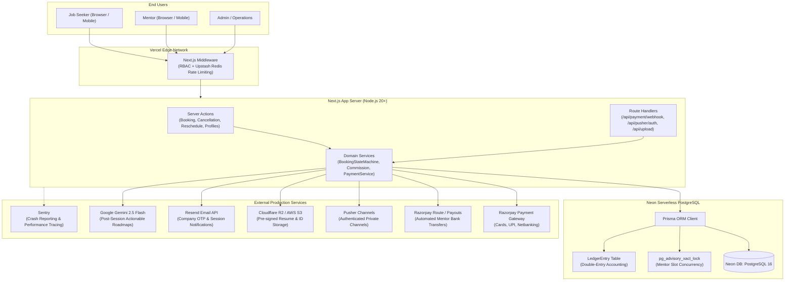
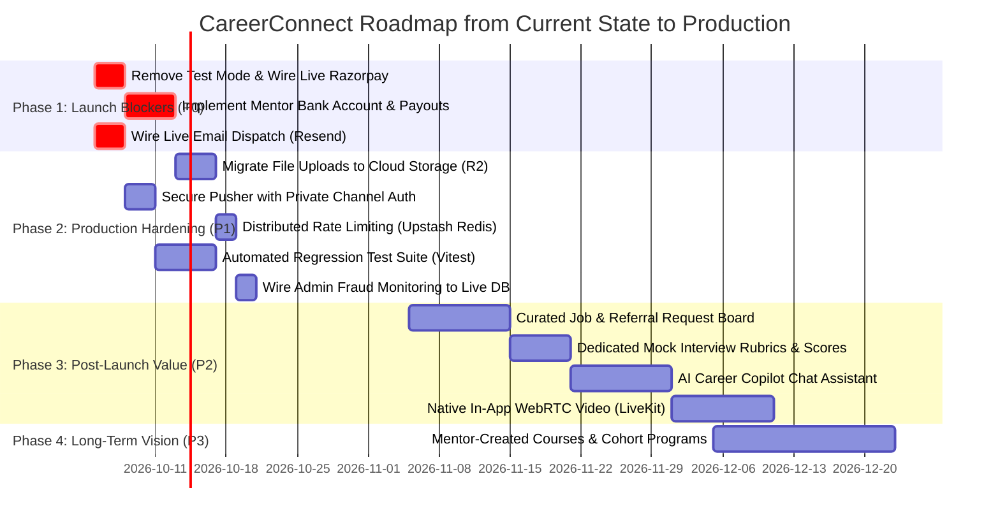

# CareerConnect — Complete Technology Stack, Architecture & Production Roadmap

**Target Project:** CareerConnect (`sas platform/career-connect`)  
**Document Purpose:** Definitive Technical Architecture, Dependency Verification, Feature Mapping & Completion Roadmap  
**Status:** Audit & Architecture Blueprint (Zero application code modified)  
**Date:** October 2026  

---

# PART 1 — COMPLETE CURRENT TECH STACK

This section documents every library, framework, service, and architectural component discovered in the current CareerConnect codebase. Every technology was verified against actual source code imports and runtime usage rather than relying solely on `package.json`.

### Technology Stack Master Table

| Layer | Technology | Version | Actual Usage | Key Source Files | Status |
|---|---|---|---|---|---|
| **Frontend Framework** | Next.js (App Router) | `16.2.9` | Core SSR/CSR rendering, Turbopack dev server, dynamic routing | [`next.config.ts`](file:///c:/Users/LENOVO/Desktop/sas%20platform/career-connect/next.config.ts), [`src/app/layout.tsx`](file:///c:/Users/LENOVO/Desktop/sas%20platform/career-connect/src/app/layout.tsx) | 🟢 ACTUALLY USED |
| **Frontend Core** | React / React DOM | `19.2.4` | Modern React 19 primitives, Server Actions, Transitions | [`package.json`](file:///c:/Users/LENOVO/Desktop/sas%20platform/career-connect/package.json), UI components | 🟢 ACTUALLY USED |
| **Language** | TypeScript | `^5.0.0` | Strict static typing across actions, models, and components | [`tsconfig.json`](file:///c:/Users/LENOVO/Desktop/sas%20platform/career-connect/tsconfig.json) | 🟢 ACTUALLY USED |
| **Styling** | Tailwind CSS / PostCSS | `^4.0.0` | Utility-first styling with modern `@tailwindcss/postcss` | [`src/app/globals.css`](file:///c:/Users/LENOVO/Desktop/sas%20platform/career-connect/src/app/globals.css), [`postcss.config.mjs`](file:///c:/Users/LENOVO/Desktop/sas%20platform/career-connect/postcss.config.mjs) | 🟢 ACTUALLY USED |
| **UI Primitives** | `@base-ui/react` | `^1.6.0` | Unstyled headless primitives (Dialog, Select, Tabs, Menu, Tooltip) | [`src/components/ui/dialog.tsx`](file:///c:/Users/LENOVO/Desktop/sas%20platform/career-connect/src/components/ui/dialog.tsx), [`select.tsx`](file:///c:/Users/LENOVO/Desktop/sas%20platform/career-connect/src/components/ui/select.tsx) | 🟢 ACTUALLY USED |
| **Icons** | Lucide React | `^1.21.0` | Icons across all user, mentor, and admin dashboards | Used in 40+ client components | 🟢 ACTUALLY USED |
| **Animations** | Framer Motion | `^12.40.0` | Page route transitions, hero animations, modals | [`src/app/page.tsx`](file:///c:/Users/LENOVO/Desktop/sas%20platform/career-connect/src/app/page.tsx), [`src/app/template.tsx`](file:///c:/Users/LENOVO/Desktop/sas%20platform/career-connect/src/app/template.tsx) | 🟢 ACTUALLY USED |
| **Data Visualization** | Recharts | `^3.8.1` | Admin revenue charts, mentor earnings breakdown | [`src/app/admin/revenue/page.tsx`](file:///c:/Users/LENOVO/Desktop/sas%20platform/career-connect/src/app/admin/revenue/page.tsx), [`MentorDashboardClient.tsx`](file:///c:/Users/LENOVO/Desktop/sas%20platform/career-connect/src/components/mentor/dashboard/MentorDashboardClient.tsx) | 🟢 ACTUALLY USED |
| **Toast Notifications** | Sonner | `^2.0.7` | Action feedback toasts (reschedule, booking, cancel) | [`src/app/layout.tsx`](file:///c:/Users/LENOVO/Desktop/sas%20platform/career-connect/src/app/layout.tsx), Action callers | 🟢 ACTUALLY USED |
| **Forms Management** | React Hook Form | `^7.85.0` | Multi-field arrays in profile edit & mentor wizard | [`src/app/dashboard/profile/edit/page.tsx`](file:///c:/Users/LENOVO/Desktop/sas%20platform/career-connect/src/app/dashboard/profile/edit/page.tsx) | 🟢 ACTUALLY USED |
| **Rich Text Editor** | React Quill | `^2.0.0` | Configured in package.json but not imported in source | [`package.json`](file:///c:/Users/LENOVO/Desktop/sas%20platform/career-connect/package.json) | ⚪ CONFIGURED / UNUSED |
| **Client Fetching / SWR**| SWR | `^2.4.2` | Data fetching, auto-revalidation, polling safety net | [`BookingsClient.tsx`](file:///c:/Users/LENOVO/Desktop/sas%20platform/career-connect/src/components/dashboard/BookingsClient.tsx), [`MentorBookingsClient.tsx`](file:///c:/Users/LENOVO/Desktop/sas%20platform/career-connect/src/components/mentor/MentorBookingsClient.tsx) | 🟢 ACTUALLY USED |
| **Date & Timezone** | `date-fns` & `date-fns-tz`| `^4.4.0` / `^3.2.0` | Timezone conversion (`fromZonedTime`), slot parsing | [`src/actions/booking-actions.ts`](file:///c:/Users/LENOVO/Desktop/sas%20platform/career-connect/src/actions/booking-actions.ts), [`CancellationModal.tsx`](file:///c:/Users/LENOVO/Desktop/sas%20platform/career-connect/src/components/booking/CancellationModal.tsx) | 🟢 ACTUALLY USED |
| **Theme Management** | Next Themes | `^0.4.6` | Dark/light theme toggling with CSS variables | [`src/components/theme-provider.tsx`](file:///c:/Users/LENOVO/Desktop/sas%20platform/career-connect/src/components/theme-provider.tsx) | 🟢 ACTUALLY USED |
| **CSS Utilities** | `clsx` & `tailwind-merge`| `^2.1.1` / `^3.6.0` | Dynamic class concatenation & Tailwind conflict resolution | [`src/lib/utils.ts`](file:///c:/Users/LENOVO/Desktop/sas%20platform/career-connect/src/lib/utils.ts) | 🟢 ACTUALLY USED |
| **ORM / Database Client**| Prisma Client | `^5.22.0` | Schema definition, queries, transactions, migrations | [`prisma/schema.prisma`](file:///c:/Users/LENOVO/Desktop/sas%20platform/career-connect/prisma/schema.prisma), [`src/lib/prisma.ts`](file:///c:/Users/LENOVO/Desktop/sas%20platform/career-connect/src/lib/prisma.ts) | 🟢 ACTUALLY USED |
| **Database Server** | Neon PostgreSQL | Cloud / Serverless | Managed PostgreSQL with connection pooling | `.env` (`DATABASE_URL`, `DIRECT_URL`) | 🟢 ACTUALLY USED |
| **Authentication** | NextAuth.js | `^4.24.14` | JWT session management, Credentials provider, RBAC | [`src/lib/auth.ts`](file:///c:/Users/LENOVO/Desktop/sas%20platform/career-connect/src/lib/auth.ts), [`src/middleware.ts`](file:///c:/Users/LENOVO/Desktop/sas%20platform/career-connect/src/middleware.ts) | 🟢 ACTUALLY USED |
| **Password Hashing** | BcryptJS | `^3.0.3` | Password hashing (10 salt rounds) | [`src/lib/auth.ts`](file:///c:/Users/LENOVO/Desktop/sas%20platform/career-connect/src/lib/auth.ts), [`src/app/api/register/route.ts`](file:///c:/Users/LENOVO/Desktop/sas%20platform/career-connect/src/app/api/register/route.ts) | 🟢 ACTUALLY USED |
| **MFA / TOTP** | `otplib` & `qrcode` | `^13.4.1` / `^1.5.4` | TOTP secret generation, QR code Data URI generation | [`src/app/api/auth/mfa/setup/route.ts`](file:///c:/Users/LENOVO/Desktop/sas%20platform/career-connect/src/app/api/auth/mfa/setup/route.ts) | 🟢 ACTUALLY USED |
| **Payments Gateway** | Razorpay Node SDK | `^2.9.8` | Order creation, payment capture verification, refunds | [`src/lib/razorpay.ts`](file:///c:/Users/LENOVO/Desktop/sas%20platform/career-connect/src/lib/razorpay.ts), [`src/actions/cancellation-actions.ts`](file:///c:/Users/LENOVO/Desktop/sas%20platform/career-connect/src/actions/cancellation-actions.ts) | 🟡 PARTIALLY USED (Test Mode Active) |
| **Realtime Gateway** | Pusher Server & Client | `^5.3.4` / `^8.5.0` | Event broadcasting for bookings, messages, cancellations | [`src/lib/pusher.ts`](file:///c:/Users/LENOVO/Desktop/sas%20platform/career-connect/src/lib/pusher.ts), [`src/lib/pusher-client.ts`](file:///c:/Users/LENOVO/Desktop/sas%20platform/career-connect/src/lib/pusher-client.ts) | 🟡 PARTIALLY USED (Public Channels Only) |
| **AI Integration** | Google GenAI SDK | `^2.12.0` | Gemini 2.5 Flash post-session roadmap generator | [`src/actions/booking-actions.ts:L860`](file:///c:/Users/LENOVO/Desktop/sas%20platform/career-connect/src/actions/booking-actions.ts#L860) | 🔵 FOUNDATION (Single Action Only) |
| **File Validation** | `file-type` | `^22.0.1` | Magic byte buffer inspection for image/PDF validation | [`src/app/api/upload/route.ts:L33`](file:///c:/Users/LENOVO/Desktop/sas%20platform/career-connect/src/app/api/upload/route.ts#L33) | 🟢 ACTUALLY USED |
| **Email Transport** | Nodemailer | `^7.0.13` | SMTP transport client configured for Ethereal/Gmail | [`src/lib/email.ts`](file:///c:/Users/LENOVO/Desktop/sas%20platform/career-connect/src/lib/email.ts) | 🟡 PARTIALLY USED (OTP uses console.log) |
| **Object Storage** | None (Base64 Data URIs)| N/A | Files converted to inline Base64 data URIs | [`src/app/api/upload/route.ts:L48`](file:///c:/Users/LENOVO/Desktop/sas%20platform/career-connect/src/app/api/upload/route.ts#L48) | 🔴 NOT PRODUCTION READY |
| **Automated Testing** | None | N/A | No test runner configured in `package.json` | Scratch scripts (`verify_phase1.ts`) only | 🔴 NOT IMPLEMENTED |

---

### Detailed Layer Inspections

#### 1. Frontend Layer
- **Framework & Routing**: Next.js 16.2.9 with App Router. Layout nesting is structured via `src/app/layout.tsx`, `template.tsx` (Framer Motion page fade-in), and route groups (`/admin`, `/mentor`, `/dashboard`).
- **Component Architecture**: Built around atomic UI components in `src/components/ui/` that wrap `@base-ui/react` primitives. Unlike standard shadcn/ui (which uses Radix UI), CareerConnect utilizes `@base-ui/react` primitives (`Dialog`, `Select`, `Tabs`, `Button`, `Menu`).
- **State & Data Fetching**: Server state is handled via SWR with auto-refresh intervals (10s on admin payments and availability, 60s on notifications). Client state is localized via React hooks (`useState`, `useTransition`, `useCallback`, `useMemo`).
- **Form Handling**: Complex forms (e.g., [`MentorProfileClient.tsx`](file:///c:/Users/LENOVO/Desktop/sas%20platform/career-connect/src/components/mentor/MentorProfileClient.tsx) and [`profile/edit/page.tsx`](file:///c:/Users/LENOVO/Desktop/sas%20platform/career-connect/src/app/dashboard/profile/edit/page.tsx)) use `react-hook-form` with `useFieldArray` for experiences, educations, and skills. Simpler forms use controlled state and Server Actions with `useTransition`.

#### 2. Backend Layer
- **Server Runtime**: Node.js 20+ runtime utilizing Next.js Server Actions (`"use server"`) for data mutations and Next.js Route Handlers (`route.ts`) for webhook endpoints and file uploads.
- **Middleware**: Edge middleware in [`src/middleware.ts`](file:///c:/Users/LENOVO/Desktop/sas%20platform/career-connect/src/middleware.ts) enforces route-level Role-Based Access Control (RBAC) and performs in-memory rate limiting (200 requests/window per IP).
- **Domain Services**: Encapsulated business logic:
  - [`src/lib/booking-state.ts`](file:///c:/Users/LENOVO/Desktop/sas%20platform/career-connect/src/lib/booking-state.ts): State machine enforcing legal transitions (`PENDING`, `CONFIRMED`, `COMPLETED`, `CANCELLED`, `REJECTED`).
  - [`src/lib/commission.ts`](file:///c:/Users/LENOVO/Desktop/sas%20platform/career-connect/src/lib/commission.ts): Deterministic integer arithmetic calculating 10% platform take-rate and 90% mentor payout.
  - [`src/lib/payment-service.ts`](file:///c:/Users/LENOVO/Desktop/sas%20platform/career-connect/src/lib/payment-service.ts): Handles ledger entries and refund reversals.

#### 3. Database Layer
- **Database Engine**: Neon Serverless PostgreSQL running in AWS `us-east-2`.
- **ORM & Connection Strategy**: Prisma Client 5.22.0 configured with dual connection strings:
  - `DATABASE_URL`: Connection pooler endpoint (`pgbouncer=true`, connection limit 20).
  - `DIRECT_URL`: Direct unpooled connection used for migrations and schema pushes.
- **Concurrency & Transaction Isolation**:
  - Interactive transactions (`prisma.$transaction(async (tx) => { ... }, { maxWait: 10000, timeout: 20000 })`).
  - PostgreSQL transaction-level advisory locks via `tx.$executeRaw`SELECT pg_advisory_xact_lock(hashtext(${mentorId}))`` to serialize slot reservations.
- **Data Integrity**: 44 models with relational foreign keys (`Cascade` on child items, `SetNull` on audit and ledger relations). Composite indexes on high-frequency queries: `@@index([mentorId, startTime, status])`, `@@index([userId, startTime])`.

#### 4. Authentication & Identity Layer
- **Session Architecture**: NextAuth.js v4 using JSON Web Tokens (JWT). Sessions store user ID, role, and premium status.
- **Credential Auth**: Email + bcrypt-hashed password with 10 rounds of salting.
- **Social OAuth**: Google and GitHub OAuth providers are conditionally enabled in [`src/lib/auth.ts`](file:///c:/Users/LENOVO/Desktop/sas%20platform/career-connect/src/lib/auth.ts) if client credentials exist in environment variables.
- **Multi-Factor Authentication (MFA)**: Foundations for TOTP MFA are implemented via `otplib` and `qrcode` in [`src/app/api/auth/mfa/setup/route.ts`](file:///c:/Users/LENOVO/Desktop/sas%20platform/career-connect/src/app/api/auth/mfa/setup/route.ts); verification during login is conditionally supported in `auth.ts`.
- **Security Protections**: User model tracks `failedLoginAttempts`, `lockedUntil`, and `jwtVersion` for session invalidation.

#### 5. Payments & Financial System
- **Gateway**: Razorpay Node SDK (`razorpay` npm package).
- **Price Authority**: Server-side price validation; client cannot alter booking prices.
- **Verification**: HMAC-SHA256 signature verification over `order_id + "|" + payment_id` in [`/api/payment/verify`](file:///c:/Users/LENOVO/Desktop/sas%20platform/career-connect/src/app/api/payment/verify/route.ts).
- **Webhooks**: [`/api/payment/webhook`](file:///c:/Users/LENOVO/Desktop/sas%20platform/career-connect/src/app/api/payment/webhook/route.ts) handles `payment.captured`, `payment.failed`, and `refund.processed` with durable idempotency via `WebhookEvent`.
- **Financial Ledger**: Double-entry ledger (`LedgerEntry` model) records gross, fee, and mentor net earnings; executes reversing credit entries on refunds.
- **CRITICAL DEFICIENCY**: Frontend hardcodes `const isTestMode = true;` in [`BookingPageClient.tsx:L517`](file:///c:/Users/LENOVO/Desktop/sas%20platform/career-connect/src/components/booking/BookingPageClient.tsx#L517) and [`RazorpayButton.tsx:L32`](file:///c:/Users/LENOVO/Desktop/sas%20platform/career-connect/src/components/payment/RazorpayButton.tsx#L32), completely bypassing the Razorpay checkout script and routing to `/api/payment/verify-test`. No automated payout mechanism exists for mentors to withdraw funds.

#### 6. Realtime Layer
- **Provider**: Pusher Channels (`pusher` server SDK and `pusher-js` client SDK).
- **Architecture**: Database-first pattern. All mutations commit to PostgreSQL first; Pusher triggers are dispatched inside post-commit `try/catch` blocks.
- **Client Fallback**: SWR polling (10s to 60s) ensures eventual consistency if WebSocket connections drop.
- **CRITICAL DEFICIENCY**: Pusher channels are unauthenticated public channels (`mentor-${id}`, `user-${id}`, `conversation-${id}`). No `/api/pusher/auth` endpoint exists, exposing real-time event payloads to anyone with the public key.

#### 7. File Storage Layer
- **Current Mechanism**: Files uploaded via [`src/app/api/upload/route.ts`](file:///c:/Users/LENOVO/Desktop/sas%20platform/career-connect/src/app/api/upload/route.ts) are read into memory, inspected for magic bytes via `file-type`, and returned as **inline Base64 data URIs** (`data:application/pdf;base64,...`).
- **CRITICAL DEFICIENCY**: Storing multi-megabyte Base64 strings directly in PostgreSQL text columns (`fileUrl`) will lead to severe database bloat and memory pressure. Cloud object storage (AWS S3, Cloudflare R2, or Supabase Storage) is mandatory for production.

#### 8. Email & Notifications Layer
- **In-App Notifications**: Backed by `Notification` model and queried via SWR in [`NotificationDropdown.tsx`](file:///c:/Users/LENOVO/Desktop/sas%20platform/career-connect/src/components/layout/NotificationDropdown.tsx).
- **Email**: Nodemailer transport is initialized in [`src/lib/email.ts`](file:///c:/Users/LENOVO/Desktop/sas%20platform/career-connect/src/lib/email.ts) with Ethereal SMTP defaults.
- **CRITICAL DEFICIENCY**: Company domain verification OTPs are printed to server stdout via `console.log` in [`src/app/api/verify-company/route.ts:L34`](file:///c:/Users/LENOVO/Desktop/sas%20platform/career-connect/src/app/api/verify-company/route.ts#L34). No live transactional email provider (Resend, SendGrid, or AWS SES) is connected.

#### 9. AI Integration Layer
- **SDK**: `@google/genai` (version 2.12.0) calling `gemini-2.5-flash`.
- **Current Scope**: Implemented strictly in [`src/actions/booking-actions.ts:L858-L896`](file:///c:/Users/LENOVO/Desktop/sas%20platform/career-connect/src/actions/booking-actions.ts#L858-L896). It ingests mentor notes (`weakness`, `strength`, `recommendation`) and outputs structured discussion topics, interview tips, missing skills, projects to build, and actionable follow-up tasks. If `GEMINI_API_KEY` is missing, it falls back to hardcoded mock data.
- **Target Vision Gaps**: AI Career Copilot, resume parser, mock interview practice bot, and AI mentor matching are not implemented.

---

# PART 2 — COMPLETE CURRENT FEATURE ARCHITECTURE

The following table maps every individual feature across the platform, documenting its frontend implementation, backend handling, database persistence, security controls, realtime integration, test coverage, and final operational status.

| Product Area | Feature | Frontend Component | Backend Action / API | Database Model | Security & IDOR | Realtime Event | Automated Tests | Current Status |
|---|---|---|---|---|---|---|---|---|
| **Job Seeker** | Registration | `src/app/signup/page.tsx` | `POST /api/register` | `User` | Password bcrypt hash (10 rounds) | None | None | 🟢 FULL |
| **Job Seeker** | Login | `src/app/login/page.tsx` | NextAuth `signIn("credentials")` | `User` | Failed attempt tracker, lockout | None | None | 🟢 FULL |
| **Job Seeker** | Profile Editing | `src/app/dashboard/profile/edit/page.tsx` | `updateJobSeekerProfile()` | `User`, `Experience`, `Education` | Session ownership check | None | None | 🟢 FULL |
| **Job Seeker** | Mentor Discovery | `src/components/mentors/MentorsContent.tsx` | `getMentors()` | `Mentor`, `Skill`, `SessionType` | Public sanitized query | None | None | 🟢 FULL |
| **Job Seeker** | Saved Mentors | `src/components/mentors/MentorResultCard.tsx` | `POST /api/saved-mentors` | `SavedMentor` | User ID verified from session | None | None | 🟢 FULL |
| **Job Seeker** | Booking Creation | `src/components/booking/BookingPageClient.tsx` | `createBooking()` | `Booking`, `Payment` | PostgreSQL Advisory Lock | None | Manual script | 🟡 PARTIAL (Test Mode Hardcoded) |
| **Job Seeker** | Payment Capture | `src/components/payment/RazorpayButton.tsx` | `POST /api/payment/verify` | `Payment`, `LedgerEntry` | HMAC-SHA256 signature check | `new-booking` | None | 🟡 PARTIAL (Bypassed in UI) |
| **Job Seeker** | My Bookings View | `src/components/dashboard/BookingsClient.tsx` | SWR query to `/api/bookings` | `Booking`, `Mentor` | Filtered strictly by `userId` | `cancellation-approved` | None | 🟢 FULL |
| **Job Seeker** | Reschedule Request | `src/components/booking/RescheduleModal.tsx` | `createRescheduleRequest()` | `RescheduleRequest`, `Notification` | Advisory lock + conflict check | Notification push | None | 🟢 FULL |
| **Job Seeker** | Cancel Booking UI | `src/components/dashboard/BookingsClient.tsx:L377` | Button opens `CancellationModal` | `Booking` | Disabled during pending requests | None | None | 🟢 FULL |
| **Job Seeker** | Cancel Request Action| `src/components/booking/CancellationModal.tsx` | `requestBookingCancellationAction()` | `CancellationRequest`, `Notification` | IDOR ownership check | `cancellation-request` | None | 🟢 FULL |
| **Job Seeker** | Meeting Entry | Join button in `BookingsClient.tsx` | `GET /api/meetings/[id]/join` | `Booking` | IDOR + time window validation | None | None | 🟢 FULL |
| **Job Seeker** | Reviews Submission | Review button in `BookingsClient.tsx` | `submitReview()` | `Review`, `Mentor` | Unique constraint per booking | None | None | 🟢 FULL |
| **Job Seeker** | Direct Messaging | `src/components/messages/MessagesClient.tsx` | `sendMessage()`, `getMessages()` | `Conversation`, `Message` | Thread participant verification | `new-message` | None | 🟢 FULL |
| **Job Seeker** | Document Vault | `src/components/dashboard/DocumentsClient.tsx` | `GET /api/documents` | `UserDocument` | Filtered by session user ID | None | None | 🟡 PARTIAL (Base64 storage) |
| **Job Seeker** | Tasks Tracker | `src/components/dashboard/TasksClient.tsx` | `GET/POST /api/tasks` | `JobSeekerTask` | Filtered by session user ID | None | None | 🟢 FULL |
| **Job Seeker** | Subscriptions View | `src/components/dashboard/SubscriptionsClient.tsx` | `GET /api/subscriptions/me` | `Subscription`, `Invoice` | Filtered by session user ID | None | None | 🔵 FOUNDATION (Seed data only) |
| **Job Seeker** | AI Career Copilot | Target Vision Only | None | None | None | None | None | 🔴 NOT IMPLEMENTED |
| **Job Seeker** | Job Opportunities | `JobSeekerDashboardClient.tsx:L211` (widget) | None | None | None | None | None | 🔴 NOT IMPLEMENTED |
| **Mentor** | Registration Wizard | `src/app/mentor-register/page.tsx` | Multi-step Server Actions | `Mentor`, `User` | Role checks | None | Manual script | 🟢 FULL |
| **Mentor** | Document Upload | `src/app/mentor-register/documents/page.tsx` | `POST /api/upload` | `VerificationDocument` | Authenticated session check | None | None | 🟡 PARTIAL (Base64 storage) |
| **Mentor** | Company Verification| `src/components/mentor/CompanyVerificationModal.tsx` | `POST /api/verify-company` | `CompanyEmailOTP` | 5-minute expiration | None | None | 🟡 PARTIAL (OTP in console) |
| **Mentor** | Weekly Availability | `src/app/mentor/availability/page.tsx` | `updateMentorWeeklySchedule()` | `WeeklySchedule` | Mentor profile ownership check | None | None | 🟢 FULL |
| **Mentor** | Blocked Dates | `src/app/mentor/availability/page.tsx` | `addBlockedDate()` | `BlockedDate` | Mentor profile ownership check | None | None | 🟢 FULL |
| **Mentor** | Mentorship Services | `src/app/mentor-register/offerings/page.tsx` | `createSessionType()` | `SessionType` | Mentor profile ownership check | None | None | 🟢 FULL |
| **Mentor** | Booking Accept/Reject| `src/components/mentor/MentorBookingsClient.tsx` | `acceptBooking()`, `rejectBooking()` | `Booking`, `Notification` | State machine validation | Notification push | None | 🟢 FULL |
| **Mentor** | Cancellation Review | `src/components/mentor/MentorBookingsClient.tsx:L399`| `approveCancellationAction()` | `CancellationRequest`, `Payment`, `Ledger` | Advisory lock + IDOR | `cancellation-approved` | None | 🟢 FULL |
| **Mentor** | Reschedule Review | `src/components/mentor/MentorBookingsClient.tsx:L417`| `acceptRescheduleRequest()` | `RescheduleRequest`, `Booking` | Advisory lock + conflict check | Notification push | None | 🟢 FULL |
| **Mentor** | Post-Session Notes | `src/components/mentor/CompleteSessionModal.tsx` | `completeSession()` | `SessionNote`, `SessionSummary` | Mentor ownership check | None | None | 🟢 FULL |
| **Mentor** | Earnings Dashboard | `src/app/mentor/earnings/page.tsx` | Server Action calculations | `Booking`, `Payment` | Filtered by mentor bookings | None | None | 🟡 PARTIAL (No withdrawals) |
| **Mentor** | Payout Withdrawal | `src/app/mentor/earnings/page.tsx:L79` | None (button has no handler) | None | None | None | None | 🔴 NOT IMPLEMENTED |
| **Mentor** | Course Creation | Target Vision Only | None | None | None | None | None | 🔴 NOT IMPLEMENTED |
| **Admin** | Admin Login | `src/app/admin-login/page.tsx` | NextAuth `signIn("credentials")` | `User` | `role === "ADMIN"` requirement | None | None | 🟢 FULL |
| **Admin** | Executive Dashboard | `src/app/admin/page.tsx` | `getAdminDashboardStats()` | Aggregates `User`, `Booking`, `Payment` | Double-checked admin role | None | None | 🟢 FULL |
| **Admin** | Verification Queue | `src/app/admin/verification/page.tsx` | `approveMentor()`, `rejectMentor()` | `Mentor`, `AdminReview` | Role check + audit logging | Notification push | None | 🟢 FULL |
| **Admin** | User Management | `src/app/admin/users/page.tsx` | `suspendUserAccount()`, `deleteUserAccount()`| `User` | Admin authorization check | Notification push | None | 🟢 FULL |
| **Admin** | Payment Oversight | `src/app/admin/payments/page.tsx` | `getAdminPayments()` | `Payment`, `Booking`, `User` | Admin authorization check | None | None | 🟢 FULL |
| **Admin** | Revenue Analytics | `src/app/admin/revenue/page.tsx` | `getAdminRevenueTrend()` | `Payment` aggregate queries | Admin authorization check | None | None | 🟢 FULL |
| **Admin** | Support Desk | `src/app/admin/support/page.tsx` | `getAdminSupportData()`, `replyTicket()` | `SupportTicket`, `SupportMessage` | Admin authorization check | None | None | 🟢 FULL |
| **Admin** | Fraud Monitoring | `src/app/admin/fraud/page.tsx` | None (reads `FRAUD_RECORDS` mock) | `SecurityEvent` (unused in UI) | UI only | None | None | 🟠 UI ONLY |

---

# PART 3 — CAREERCONNECT TARGET PRODUCT VISION

CareerConnect is built to bridge the professional guidance gap for individuals who lack established networks, senior alumni, or industry mentors.

### 15 Core Capabilities Required for the Complete Product Vision

1. **Verified Industry Discovery**: Search and verify working professionals across companies, roles, and domains.
2. **Transparent Mentor Profiles**: Detailed career histories, verified company badges, verified reviews, and clear service pricing.
3. **1-on-1 Mentorship Booking**: Frictionless scheduling respecting real mentor availability and timezones.
4. **Targeted Career Advice**: Objective guidance on career pivots, job market realities, and skill valuations.
5. **Mock Interviews & Standardized Feedback**: Repeatable interview simulations with structured scoring rubrics.
6. **Post-Session Improvement Plans**: Actionable takeaways, curated tasks, and structured learning roadmaps.
7. **Mentor-Created Courses & Cohorts**: Structured group courses and workshops hosted by mentors.
8. **Continuous Mentorship Journeys**: Long-term guidance extending beyond a single 45-minute booking.
9. **Course & Skill Validation**: Unbiased advice on whether external certifications or degree programs are worth the investment.
10. **Curated Job Opportunities**: Direct discovery of openings shared by mentors within their organizations.
11. **Merit-Based Referrals**: Transparent referral requests where company policies and mentor discretion permit.
12. **AI Career Copilot**: 24/7 AI-powered assistant for resume critiques, skill-gap analysis, and interview prep.
13. **Centralized Career Workspace**: All notes, session recordings, action items, and documents managed in one platform.
14. **Fair Financial System**: Reliable payments, 24-hour refund guarantees, double-entry ledgers, and prompt mentor payouts.
15. **Integrity & Trust**: Clear disclaimers stating that the platform provides guidance and access, not guaranteed employment.

---

# PART 4 — WHAT IS MISSING FOR THE FULL VISION?

The following gap analysis compares the **Current Working Codebase** against the **Complete Target Product Vision**.

| Target Capability | Current Status | Missing Work Required | Dependencies | Priority |
|---|---|---|---|---|
| **1. Mentor Marketplace** | 🟢 90% Complete | Search query optimization for large catalogs; multi-currency display | None | P2 |
| **2. One-on-One Mentorship** | 🟢 90% Complete | Automated calendar syncing (Google Calendar / Outlook) | Calendar OAuth | P2 |
| **3. Mock Interviews** | 🟡 50% Complete | Dedicated mock interview evaluation rubric and scorecards (currently uses basic notes) | Schema updates | P2 |
| **4. Mentor-Created Courses** | 🔴 0% Complete | Course, lesson, enrollment models; video/content hosting; cohort payments | Video CDN, DB models | P3 |
| **5. Career Guidance & Roadmaps**| 🟢 75% Complete | Roadmaps exist via Gemini AI; needs mentee progress tracking on roadmap nodes | DB models | P2 |
| **6. Job Opportunities Board** | 🔴 0% Complete | Job listing schema, company job board UI, application tracking | DB models | P2 |
| **7. Referral System** | 🔴 0% Complete | Referral request workflow, mentor screening, referral status tracking | Job Board | P2 |
| **8. Professional Networking** | 🟡 30% Complete | 1-on-1 messaging exists; needs mentee-to-mentee networking & community discussions | Forum schema | P3 |
| **9. Direct Messaging** | 🟢 85% Complete | Message attachments, typing indicators, read receipts | Cloud storage | P2 |
| **10. Payment Processing** | 🟡 60% Complete | Remove hardcoded test mode; deploy live Razorpay credentials; test live card/UPI flows | Live Razorpay account | P0 |
| **11. Refunds Execution** | 🟢 90% Complete | Automated refund webhook verification and batch reconciliation scripts | Webhook secret | P1 |
| **12. Mentor Payouts & Settlements**| 🔴 0% Complete | Mentor bank details schema, KYC collection, Razorpay Route / Payouts API integration | Payment Gateway KYC | P0 |
| **13. Financial Reconciliation**| 🟡 50% Complete | Ledger exists; missing automated daily reconciliation and CSV/Excel export tools | Ledger export action | P1 |
| **14. Realtime Infrastructure**| 🟡 50% Complete | Implement `/api/pusher/auth`; migrate channels to `private-`; enforce authorization | Pusher Auth | P1 |
| **15. AI Career Copilot** | 🔴 0% Complete | Interactive AI chat assistant for 24/7 career advice and query resolution | LLM API, Chat UI | P2 |
| **16. AI Resume Analysis** | 🔴 0% Complete | PDF resume text extractor, prompt engineering for ATS scoring and critiques | PDF parser, LLM | P2 |
| **17. AI Skill-Gap Analysis** | 🔴 0% Complete | Comparison engine between job descriptions and user profile skills | Skill taxonomy | P2 |
| **18. AI Mentor Matching** | 🔴 0% Complete | Vector embeddings / similarity matching between mentee goals and mentor bios | Vector DB / pgvector | P3 |
| **19. Career Recommendations** | 🔴 0% Complete | Automated recommendations for target roles, salary benchmarks, and next steps | Market dataset | P3 |
| **20. Admin Operations** | 🟢 80% Complete | Wire Admin Fraud page to live database tables (`SecurityEvent`, `LoginHistory`) | Server Action | P1 |
| **21. Platform Security** | 🟡 65% Complete | Replace in-memory rate limiting with Upstash Redis; stream uploads to S3 | Redis, S3 | P1 |
| **22. Automated Testing** | 🔴 0% Complete | Install Vitest and Playwright; write unit, integration, and E2E regression tests | Test framework | P1 |
| **23. Observability & Logging** | 🔵 20% Complete | Integrate Sentry for error tracking; configure structured Pino server logging | Sentry DSN | P1 |
| **24. Production Infrastructure**| 🟡 40% Complete | Set up CI/CD pipeline in GitHub Actions; configure production CDN and storage | Cloud accounts | P1 |

---

# PART 5 — DEVELOPMENT COMPLETION ESTIMATES

### Completion by Dimension

To ensure total transparency, percentages are calculated based on concrete codebase evidence rather than line-of-code counts.

```
Dimension Formula:
Completion % = (Implemented & Verified Requirements / Total Production Requirements) * 100
```

| Dimension | Score | Calculation Methodology & Code Evidence |
|---|---|---|
| **Frontend UI/UX** | **68%** | All Job Seeker, Mentor, and Admin dashboards, forms, and modals are built. Missing course creation UI, job board, AI copilot chat, and payout withdrawal dialog. |
| **Backend Architecture** | **62%** | State machines, advisory locks, double-entry ledger, and server actions exist. Missing payout execution engine, S3 file streaming, distributed rate-limiting, and real email dispatch. |
| **Database Models** | **75%** | 44 models implemented with relationships and query indexes. Missing models for `MentorBankAccount`, `PayoutBatch`, `Course`, and `JobOpportunity`. |
| **Authentication & RBAC** | **85%** | NextAuth JWT, bcrypt hashing, edge middleware RBAC, and TOTP foundations exist. Missing production OAuth secrets and distributed session revocation. |
| **Booking & Scheduling** | **90%** | Full slot calculation engine, timezone conversions, conflict prevention via PostgreSQL advisory locks, and two-sided reschedule/cancellation flows are operational. |
| **Payment & Finance** | **50%** | Order creation, HMAC verification, webhook idempotency, and double-entry ledger are implemented. Blocked by hardcoded test mode and total absence of mentor payouts. |
| **Realtime Infrastructure**| **45%** | Pusher event triggers and SWR polling fallbacks work. Blocked by public unauthenticated channels and lack of private channel authorization endpoints. |
| **Direct Messaging** | **85%** | 1-on-1 threads, database persistence, unread counters, and Pusher updates are built. Missing message attachments and typing indicators. |
| **Job Seeker Experience** | **65%** | Profile, discovery, booking wizard, cancellation modal, and reviews work. Missing AI copilot, mock interview rubrics, and referral request system. |
| **Mentor Experience** | **70%** | Wizard, verification upload, availability slots, booking/cancellation management, and reviews work. Missing automated bank payouts and course creation. |
| **Admin Operations** | **65%** | Verification queue, user suspension, session monitoring, and support desk are active. Fraud monitoring and payout controls are currently UI-only mocks. |
| **AI Capabilities** | **15%** | Single Gemini 2.5 Flash roadmap action exists. Zero implementation of AI Copilot, resume reviewer, mock interview bot, or matching algorithms. |
| **Courses & Programs** | **0%** | Zero database models, zero server actions, zero UI components. Entirely unbuilt. |
| **Jobs & Referrals** | **5%** | Single static UI widget (`Referrals: 0`) in Job Seeker dashboard. Zero backend models or actions. |
| **File Storage** | **25%** | In-memory upload and magic byte checks exist, but files are stored as Base64 data URIs. Zero cloud object storage connected. |
| **Automated Testing** | **0%** | Zero automated unit, integration, or E2E tests exist. No test runner in `package.json`. |
| **Production Infrastructure**| **30%** | Neon DB and Vercel configs exist. No CI/CD workflows, no Sentry, no Redis, no live payment keys. |

---

### Macro Completion Summary

#### 1. Current Working Marketplace Completion: **~72%**
*(Calculated across the 1-on-1 Mentorship Marketplace core loop: Discovery → Booking → Payment → Scheduling → Meeting → Cancellation/Refund → Review → Messaging).*  
The core loop is functionally complete in the codebase, requiring only live gateway credentials, payout wiring, and private realtime hardening to go live.

#### 2. Full CareerConnect Target Vision Completion: **~38%**
*(Calculated across the complete product vision, including Courses, Job Opportunities, Referrals, AI Copilot, Mock Interview Simulator, Mentor Payouts, and Enterprise Infrastructure).*  
Major functional pillars (Courses, Jobs, Referrals, and AI Copilot) are completely unbuilt and represent the post-launch phase of the platform.

---

# PART 6 — TECHNOLOGY GAPS & EVALUATION

The following table evaluates potential new technologies, assessing whether they are genuinely required for CareerConnect or merely unnecessary complexity.

| Technology | Why Needed | Is It Actually Necessary? | Priority | Simpler / Leaner Alternative |
|---|---|---|---|---|
| **Cloud Object Storage (AWS S3 / Cloudflare R2)** | Current Base64 data URIs bloat the PostgreSQL database when storing resumes and IDs. | **YES — ABSOLUTELY** | **P0** | **Cloudflare R2** (zero egress fees, S3-compatible API, very simple setup). |
| **Mentor Payout Engine (Razorpay Route / Payouts)** | Mentors need to receive their 90% net earnings directly into their Indian bank accounts. | **YES — ABSOLUTELY** | **P0** | **Razorpay Route** (splits payments automatically at capture) or **Razorpay Payouts API**. |
| **Transactional Email (Resend / AWS SES)** | Real email dispatch for company verification OTPs, booking invites, and cancellation alerts. | **YES — ABSOLUTELY** | **P0** | **Resend** (native Next.js integration via `resend` SDK, exceptional DX and delivery rates). |
| **Distributed Cache / Rate Limiter (Upstash Redis)** | Serverless edge middleware resets in-memory rate limits on cold starts. | **YES** (for production scale) | **P1** | **Upstash Redis** (`@upstash/ratelimit` works seamlessly in Next.js edge middleware). |
| **Automated Test Runner (Vitest + Playwright)** | Ensure payment calculations, state transitions, and advisory locks do not suffer regressions. | **YES — ABSOLUTELY** | **P1** | **Vitest** for fast unit/action tests; **Playwright** for critical booking/checkout E2E tests. |
| **Error Monitoring (Sentry)** | Capture silent runtime failures, webhook errors, and client-side exceptions in production. | **YES** | **P1** | **Sentry for Next.js** (`@sentry/nextjs` with automatic source maps and error grouping). |
| **Private Pusher Channel Auth** | Secure real-time messaging and notifications from eavesdropping. | **YES — ABSOLUTELY** | **P1** | Built into existing `pusher` SDK; only requires route handler `/api/pusher/auth`. |
| **Dedicated Background Queue (Inngest / BullMQ)** | Asynchronous video processing, automated payout retries, and scheduled reminders. | **NO** (Not for MVP) | **P2** | **Vercel Cron Jobs** + Next.js Route Handlers satisfy current scheduling needs. |
| **Dedicated Search Engine (Meilisearch / Algolia)** | Full-text mentor searching across skills, bios, and company history. | **NO** (Not for MVP) | **P2** | **PostgreSQL Full-Text Search** via Prisma (`search` mode) is sufficient up to 10,000 mentors. |
| **In-App Video SDK (LiveKit / Daily.co)** | Native video rooms directly inside CareerConnect without opening external Meet/Zoom links. | **NO** (Not for Launch) | **P2** | **External Google Meet / Zoom links** work reliably and keep platform liability low at launch. |

---

# PART 7 — TARGET PRODUCTION ARCHITECTURE



---

# PART 8 — RECOMMENDED PRODUCTION ROADMAP



### Phase 1: Pre-Launch Blockers (P0) — Target: 1.5 Weeks
* **Objective**: Remove all artificial bypasses and enable real financial transactions from job seekers to mentors.
* **Tasks**:
  1. Remove hardcoded `isTestMode = true` in [`BookingPageClient.tsx`](file:///c:/Users/LENOVO/Desktop/sas%20platform/career-connect/src/components/booking/BookingPageClient.tsx) and [`RazorpayButton.tsx`](file:///c:/Users/LENOVO/Desktop/sas%20platform/career-connect/src/components/payment/RazorpayButton.tsx).
  2. Add database model `MentorBankAccount` (`accountNumber`, `ifscCode`, `beneficiaryName`, `isVerified`).
  3. Implement Server Action `requestMentorPayoutAction(amount)` connected to Razorpay Payouts or Razorpay Route.
  4. Replace `console.log` in [`verify-company/route.ts`](file:///c:/Users/LENOVO/Desktop/sas%20platform/career-connect/src/app/api/verify-company/route.ts) with real email delivery via Resend.
  5. Deploy live Razorpay keys and register production webhook URL.
* **Definition of Done**: A real job seeker can book a session paying with live UPI/Card; payment captures in Razorpay; webhook reconciles payment; mentor views cleared balance and requests withdrawal to their verified bank account.

### Phase 2: Production Hardening (P1) — Target: 2 Weeks
* **Objective**: Protect database performance, secure real-time communications, and establish automated regression defenses.
* **Tasks**:
  1. Migrate [`src/app/api/upload/route.ts`](file:///c:/Users/LENOVO/Desktop/sas%20platform/career-connect/src/app/api/upload/route.ts) from Base64 data URIs to Cloudflare R2 / AWS S3 pre-signed upload URLs.
  2. Implement route handler `src/app/api/pusher/auth/route.ts` and migrate all client listeners to `private-` channels.
  3. Replace in-memory rate limiting in [`middleware.ts`](file:///c:/Users/LENOVO/Desktop/sas%20platform/career-connect/src/middleware.ts) with `@upstash/ratelimit`.
  4. Install Vitest and write automated tests for `createBooking` advisory locks, `BookingStateMachine`, and ledger commission splits.
  5. Connect `src/app/admin/fraud/page.tsx` to live database records (`SecurityEvent`, `LoginHistory`).
* **Definition of Done**: Database contains zero Base64 strings; all WebSocket channels enforce authentication; CI pipeline passes with automated tests.

### Phase 3: Post-Launch Product Expansion (P2) — Target: 4 Weeks
* **Objective**: Deliver on the broader networking, referral, and guidance capabilities of the CareerConnect vision.
* **Tasks**:
  1. Build Job Opportunity & Referral Request Board.
  2. Implement structured Mock Interview Evaluation Scorecards.
  3. Develop interactive AI Career Copilot assistant.
  4. Replace external meeting redirects with native WebRTC video rooms (LiveKit / Daily.co).

### Phase 4: Full CareerConnect Vision (P3) — Target: 6 Weeks
* **Objective**: Transform CareerConnect into a comprehensive cohort learning and career acceleration platform.
* **Tasks**:
  1. Implement Mentor Courses, Modules, Lessons, and Video Hosting.
  2. Group cohort enrollment and cohort discussion forums.
  3. AI-powered mentor matching and resume ATS optimization.

---

# PART 9 — "WHEN IS CAREERCONNECT 100% COMPLETE?"

To avoid ambiguous definitions of success, CareerConnect's completion is evaluated against two strict, unambiguous standards:

### Standard A: Technical Production Launch Ready (Go-Live Milestone)
The platform is **Ready for Real Users and Real Money** when:
- [x] Job Seeker booking, rescheduling, and cancellation with 24h refund checks work end-to-end.
- [x] Mentor availability, session acceptance, and cancellation review work end-to-end.
- [x] Admin mentor verification queue, user suspension, and transaction oversight work end-to-end.
- [ ] Hardcoded `isTestMode = true` is eliminated; real credit cards and UPI are accepted.
- [ ] Real Razorpay webhook endpoint is verified with automated HMAC signature checks.
- [ ] Mentors can enter verified Indian bank details and withdraw cleared earnings.
- [ ] File uploads stream to cloud object storage (R2/S3); no Base64 strings in database.
- [ ] Pusher channels require authenticated sessions via `/api/pusher/auth`.
- [ ] Company verification OTPs deliver to real inboxes via transactional email.
- [ ] Mandatory legal terms and disclaimers (*"No guaranteed jobs or referrals"*) are active.
- [ ] Automated regression tests run on CI with zero failures.

### Standard B: 100% Target Vision Complete (Full Product Milestone)
The platform is **100% Complete to the Full Target Vision** when:
- [ ] All requirements of Standard A are met.
- [ ] Mentors can create, price, and host structured multi-week courses and cohorts.
- [ ] Job seekers can browse verified job opportunities posted by mentors.
- [ ] Job seekers can request non-guaranteed internal company referrals.
- [ ] Job seekers can conduct simulated mock interviews with an AI Copilot.
- [ ] 1-on-1 sessions can be conducted directly inside native in-app WebRTC video rooms.
- [ ] Automated tax invoices and GST credit notes are generated for every financial transaction.

---

# PART 10 — EXACT FILE EVIDENCE

The following audit catalog provides explicit source-code evidence for all primary systems in the repository.

### Key Implementation Anchors

1. **Job Seeker Cancellation Button & Modal**:
   - Location: [`src/components/dashboard/BookingsClient.tsx:L377-L382`](file:///c:/Users/LENOVO/Desktop/sas%20platform/career-connect/src/components/dashboard/BookingsClient.tsx#L377-L382)
   - Functionality: Renders "Cancel Booking" button and manages `cancellingBooking` state to display `<CancellationModal>`.
2. **Cancellation Request Submission Action**:
   - Location: [`src/actions/cancellation-actions.ts:L16-L119`](file:///c:/Users/LENOVO/Desktop/sas%20platform/career-connect/src/actions/cancellation-actions.ts#L16-L119)
   - Functionality: Verifies session, validates 24-hour refund eligibility, upserts `CancellationRequest`, notifies mentor, and triggers Pusher event.
3. **Mentor Cancellation Approval Action**:
   - Location: [`src/actions/cancellation-actions.ts:L124-L285`](file:///c:/Users/LENOVO/Desktop/sas%20platform/career-connect/src/actions/cancellation-actions.ts#L124-L285)
   - Functionality: Executes Razorpay refund outside DB transaction; locks mentor via advisory lock; updates booking to `CANCELLED`; revokes meeting link; creates reversing ledger entry via `executeRefund()`.
4. **Mentor Cancellation Review UI**:
   - Location: [`src/components/mentor/MentorBookingsClient.tsx:L399-L416`](file:///c:/Users/LENOVO/Desktop/sas%20platform/career-connect/src/components/mentor/MentorBookingsClient.tsx#L399-L416)
   - Functionality: Renders "Decline" and "Approve Cancellation" buttons for pending requests.
5. **PostgreSQL Advisory Lock & Conflict Prevention**:
   - Location: [`src/actions/booking-actions.ts:L348-L365`](file:///c:/Users/LENOVO/Desktop/sas%20platform/career-connect/src/actions/booking-actions.ts#L348-L365)
   - Functionality: Calls `SELECT pg_advisory_xact_lock(hashtext(${mentorId}))` inside `$transaction` and verifies overlapping slots.
6. **Transaction Timeout & Decoupled Order Creation**:
   - Location: [`src/actions/booking-actions.ts:L397-L420`](file:///c:/Users/LENOVO/Desktop/sas%20platform/career-connect/src/actions/booking-actions.ts#L397-L420)
   - Functionality: Specifies `{ maxWait: 10000, timeout: 20000 }` and executes `razorpay.orders.create` outside database transactions.
7. **Double-Entry Financial Ledger Implementation**:
   - Location: [`src/lib/payment-service.ts:L28-L178`](file:///c:/Users/LENOVO/Desktop/sas%20platform/career-connect/src/lib/payment-service.ts#L28-L178)
   - Functionality: Atomic insertion of `LedgerEntry` on payment success and reversing negative entry on refund.
8. **Webhook Idempotency Handler**:
   - Location: [`src/app/api/payment/webhook/route.ts:L31-L50`](file:///c:/Users/LENOVO/Desktop/sas%20platform/career-connect/src/app/api/payment/webhook/route.ts#L31-L50)
   - Functionality: Verifies HMAC signature, checks `WebhookEvent` table for duplicate `eventId`, and processes payment capture or refund.
9. **Hardcoded Test Mode Bypass**:
   - Location: [`src/components/booking/BookingPageClient.tsx:L517`](file:///c:/Users/LENOVO/Desktop/sas%20platform/career-connect/src/components/booking/BookingPageClient.tsx#L517) and [`src/components/payment/RazorpayButton.tsx:L32`](file:///c:/Users/LENOVO/Desktop/sas%20platform/career-connect/src/components/payment/RazorpayButton.tsx#L32)
   - Functionality: `const isTestMode = true;` bypasses Razorpay SDK and routes to test endpoint.
10. **Console OTP Logging**:
    - Location: [`src/app/api/verify-company/route.ts:L34-L36`](file:///c:/Users/LENOVO/Desktop/sas%20platform/career-connect/src/app/api/verify-company/route.ts#L34-L36)
    - Functionality: Prints generated OTP to terminal stdout instead of dispatching via SMTP.

---

### Exact Files Scanned

- [`prisma/schema.prisma`](file:///c:/Users/LENOVO/Desktop/sas%20platform/career-connect/prisma/schema.prisma)
- [`package.json`](file:///c:/Users/LENOVO/Desktop/sas%20platform/career-connect/package.json)
- [`.env`](file:///c:/Users/LENOVO/Desktop/sas%20platform/career-connect/.env)
- [`.env.example`](file:///c:/Users/LENOVO/Desktop/sas%20platform/career-connect/.env.example)
- [`.env.local`](file:///c:/Users/LENOVO/Desktop/sas%20platform/career-connect/.env.local)
- [`next.config.ts`](file:///c:/Users/LENOVO/Desktop/sas%20platform/career-connect/next.config.ts)
- [`src/middleware.ts`](file:///c:/Users/LENOVO/Desktop/sas%20platform/career-connect/src/middleware.ts)
- [`src/lib/auth.ts`](file:///c:/Users/LENOVO/Desktop/sas%20platform/career-connect/src/lib/auth.ts)
- [`src/lib/prisma.ts`](file:///c:/Users/LENOVO/Desktop/sas%20platform/career-connect/src/lib/prisma.ts)
- [`src/lib/razorpay.ts`](file:///c:/Users/LENOVO/Desktop/sas%20platform/career-connect/src/lib/razorpay.ts)
- [`src/lib/payment-service.ts`](file:///c:/Users/LENOVO/Desktop/sas%20platform/career-connect/src/lib/payment-service.ts)
- [`src/lib/commission.ts`](file:///c:/Users/LENOVO/Desktop/sas%20platform/career-connect/src/lib/commission.ts)
- [`src/lib/booking-state.ts`](file:///c:/Users/LENOVO/Desktop/sas%20platform/career-connect/src/lib/booking-state.ts)
- [`src/lib/pusher.ts`](file:///c:/Users/LENOVO/Desktop/sas%20platform/career-connect/src/lib/pusher.ts)
- [`src/lib/pusher-client.ts`](file:///c:/Users/LENOVO/Desktop/sas%20platform/career-connect/src/lib/pusher-client.ts)
- [`src/lib/session-utils.ts`](file:///c:/Users/LENOVO/Desktop/sas%20platform/career-connect/src/lib/session-utils.ts)
- [`src/lib/email.ts`](file:///c:/Users/LENOVO/Desktop/sas%20platform/career-connect/src/lib/email.ts)
- [`src/lib/admin-mock-data.ts`](file:///c:/Users/LENOVO/Desktop/sas%20platform/career-connect/src/lib/admin-mock-data.ts)
- [`src/actions/booking-actions.ts`](file:///c:/Users/LENOVO/Desktop/sas%20platform/career-connect/src/actions/booking-actions.ts)
- [`src/actions/cancellation-actions.ts`](file:///c:/Users/LENOVO/Desktop/sas%20platform/career-connect/src/actions/cancellation-actions.ts)
- [`src/actions/reschedule-actions.ts`](file:///c:/Users/LENOVO/Desktop/sas%20platform/career-connect/src/actions/reschedule-actions.ts)
- [`src/actions/mentor-actions.ts`](file:///c:/Users/LENOVO/Desktop/sas%20platform/career-connect/src/actions/mentor-actions.ts)
- [`src/actions/availability-actions.ts`](file:///c:/Users/LENOVO/Desktop/sas%20platform/career-connect/src/actions/availability-actions.ts)
- [`src/actions/admin-actions.ts`](file:///c:/Users/LENOVO/Desktop/sas%20platform/career-connect/src/actions/admin-actions.ts)
- [`src/actions/admin-dashboard-actions.ts`](file:///c:/Users/LENOVO/Desktop/sas%20platform/career-connect/src/actions/admin-dashboard-actions.ts)
- [`src/actions/job-seeker-profile-actions.ts`](file:///c:/Users/LENOVO/Desktop/sas%20platform/career-connect/src/actions/job-seeker-profile-actions.ts)
- [`src/actions/message-actions.ts`](file:///c:/Users/LENOVO/Desktop/sas%20platform/career-connect/src/actions/message-actions.ts)
- [`src/actions/notification-actions.ts`](file:///c:/Users/LENOVO/Desktop/sas%20platform/career-connect/src/actions/notification-actions.ts)
- [`src/actions/review-actions.ts`](file:///c:/Users/LENOVO/Desktop/sas%20platform/career-connect/src/actions/review-actions.ts)
- [`src/actions/support-actions.ts`](file:///c:/Users/LENOVO/Desktop/sas%20platform/career-connect/src/actions/support-actions.ts)
- [`src/app/api/payment/create-order/route.ts`](file:///c:/Users/LENOVO/Desktop/sas%20platform/career-connect/src/app/api/payment/create-order/route.ts)
- [`src/app/api/payment/verify/route.ts`](file:///c:/Users/LENOVO/Desktop/sas%20platform/career-connect/src/app/api/payment/verify/route.ts)
- [`src/app/api/payment/verify-test/route.ts`](file:///c:/Users/LENOVO/Desktop/sas%20platform/career-connect/src/app/api/payment/verify-test/route.ts)
- [`src/app/api/payment/webhook/route.ts`](file:///c:/Users/LENOVO/Desktop/sas%20platform/career-connect/src/app/api/payment/webhook/route.ts)
- [`src/app/api/meetings/[id]/join/route.ts`](file:///c:/Users/LENOVO/Desktop/sas%20platform/career-connect/src/app/api/meetings/%5Bid%5D/join/route.ts)
- [`src/app/api/upload/route.ts`](file:///c:/Users/LENOVO/Desktop/sas%20platform/career-connect/src/app/api/upload/route.ts)
- [`src/app/api/documents/route.ts`](file:///c:/Users/LENOVO/Desktop/sas%20platform/career-connect/src/app/api/documents/route.ts)
- [`src/app/api/verify-company/route.ts`](file:///c:/Users/LENOVO/Desktop/sas%20platform/career-connect/src/app/api/verify-company/route.ts)
- [`src/app/api/seed/subscription/route.ts`](file:///c:/Users/LENOVO/Desktop/sas%20platform/career-connect/src/app/api/seed/subscription/route.ts)
- [`src/app/api/auth/mfa/setup/route.ts`](file:///c:/Users/LENOVO/Desktop/sas%20platform/career-connect/src/app/api/auth/mfa/setup/route.ts)
- [`src/components/dashboard/BookingsClient.tsx`](file:///c:/Users/LENOVO/Desktop/sas%20platform/career-connect/src/components/dashboard/BookingsClient.tsx)
- [`src/components/booking/CancellationModal.tsx`](file:///c:/Users/LENOVO/Desktop/sas%20platform/career-connect/src/components/booking/CancellationModal.tsx)
- [`src/components/booking/BookingPageClient.tsx`](file:///c:/Users/LENOVO/Desktop/sas%20platform/career-connect/src/components/booking/BookingPageClient.tsx)
- [`src/components/payment/RazorpayButton.tsx`](file:///c:/Users/LENOVO/Desktop/sas%20platform/career-connect/src/components/payment/RazorpayButton.tsx)
- [`src/components/mentor/MentorBookingsClient.tsx`](file:///c:/Users/LENOVO/Desktop/sas%20platform/career-connect/src/components/mentor/MentorBookingsClient.tsx)
- [`src/components/mentor/dashboard/MentorDashboardClient.tsx`](file:///c:/Users/LENOVO/Desktop/sas%20platform/career-connect/src/components/mentor/dashboard/MentorDashboardClient.tsx)
- [`src/components/messages/MessagesClient.tsx`](file:///c:/Users/LENOVO/Desktop/sas%20platform/career-connect/src/components/messages/MessagesClient.tsx)
- [`src/components/dashboard/SubscriptionsClient.tsx`](file:///c:/Users/LENOVO/Desktop/sas%20platform/career-connect/src/components/dashboard/SubscriptionsClient.tsx)
- [`src/components/dashboard/TasksClient.tsx`](file:///c:/Users/LENOVO/Desktop/sas%20platform/career-connect/src/components/dashboard/TasksClient.tsx)
- [`src/components/dashboard/DocumentsClient.tsx`](file:///c:/Users/LENOVO/Desktop/sas%20platform/career-connect/src/components/dashboard/DocumentsClient.tsx)
- [`src/app/mentor/earnings/page.tsx`](file:///c:/Users/LENOVO/Desktop/sas%20platform/career-connect/src/app/mentor/earnings/page.tsx)
- [`src/app/admin/fraud/page.tsx`](file:///c:/Users/LENOVO/Desktop/sas%20platform/career-connect/src/app/admin/fraud/page.tsx)
- [`src/app/admin/payments/page.tsx`](file:///c:/Users/LENOVO/Desktop/sas%20platform/career-connect/src/app/admin/payments/page.tsx)
- [`src/app/admin/support/page.tsx`](file:///c:/Users/LENOVO/Desktop/sas%20platform/career-connect/src/app/admin/support/page.tsx)
- [`src/app/admin/revenue/page.tsx`](file:///c:/Users/LENOVO/Desktop/sas%20platform/career-connect/src/app/admin/revenue/page.tsx)
- [`src/app/admin/settings/page.tsx`](file:///c:/Users/LENOVO/Desktop/sas%20platform/career-connect/src/app/admin/settings/page.tsx)
- [`verify_phase1.ts`](file:///c:/Users/LENOVO/Desktop/sas%20platform/career-connect/verify_phase1.ts)
- [`test-booking.ts`](file:///c:/Users/LENOVO/Desktop/sas%20platform/career-connect/test-booking.ts)

---

### Exact Files Changed

**NONE — audit/documentation only.**

The only new file created is:
`CAREERCONNECT_TECH_STACK_AND_COMPLETION_ROADMAP.md`
